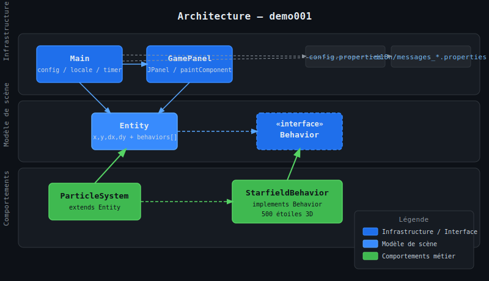
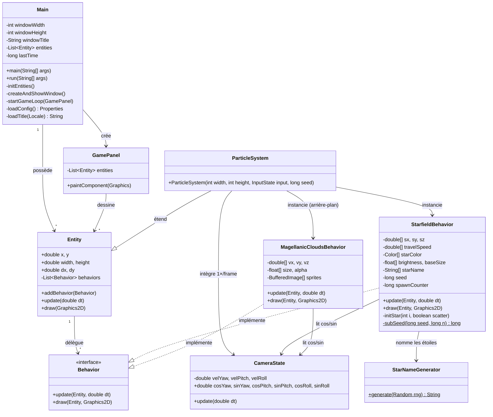
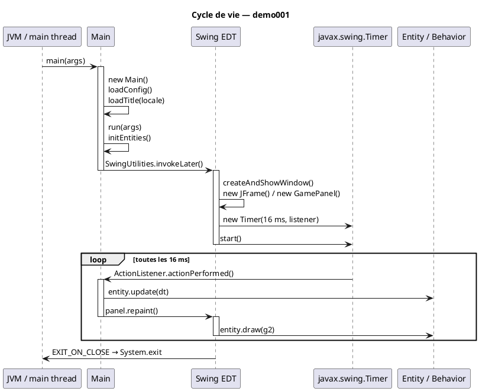
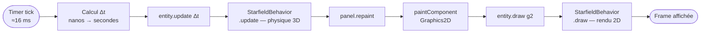

# Chapitre 1 — Architecture générale

## Vue d'ensemble

**demo001** est une application de bureau Java/Swing qui anime un champ d'étoiles 3D en vol
continu. Elle est structurée autour d'un moteur de rendu minimal, sans dépendance externe,
compilée avec Java 26 et packagée via un script `build.sh` maison.

L'architecture repose sur trois couches :

1. **Infrastructure applicative** (`Main`) — chargement de la configuration, localisation,
   gestion de la fenêtre Swing et cadençage de la boucle de jeu.
2. **Modèle de scène** (`Entity`, `Behavior`) — graphe d'objets génériques avec composition
   de comportements.
3. **Comportements métier** (`ParticleSystem`, `StarfieldBehavior`) — simulation physique
   et rendu du champ d'étoiles.

---

## Diagramme de classes

---

## Cycle de vie de l'application

---

## Flux de données par frame

---

## Configuration et internationalisation

Au démarrage, `Main` charge deux ressources depuis le classpath :

| Ressource | Rôle |
|-----------|------|
| `/config.properties` | Dimensions de la fenêtre, code de langue |
| `i18n/messages_*.properties` | Titre localisé de la fenêtre |

Les codes de langue supportés sont **EN**, **FR**, **DE**, **ES**, **IT**.
La locale est construite via `Locale.of(langCode.toLowerCase())` et passée à
`ResourceBundle.getBundle("i18n.messages", locale)`.

---

> Chapitres suivants :
> - [02 — Pattern Entity / Behavior](02-entity-behavior.md)
> - [03 — ParticleSystem](03-particle-system.md)
> - [07 — Boucle de jeu et Swing](07-game-loop.md)
