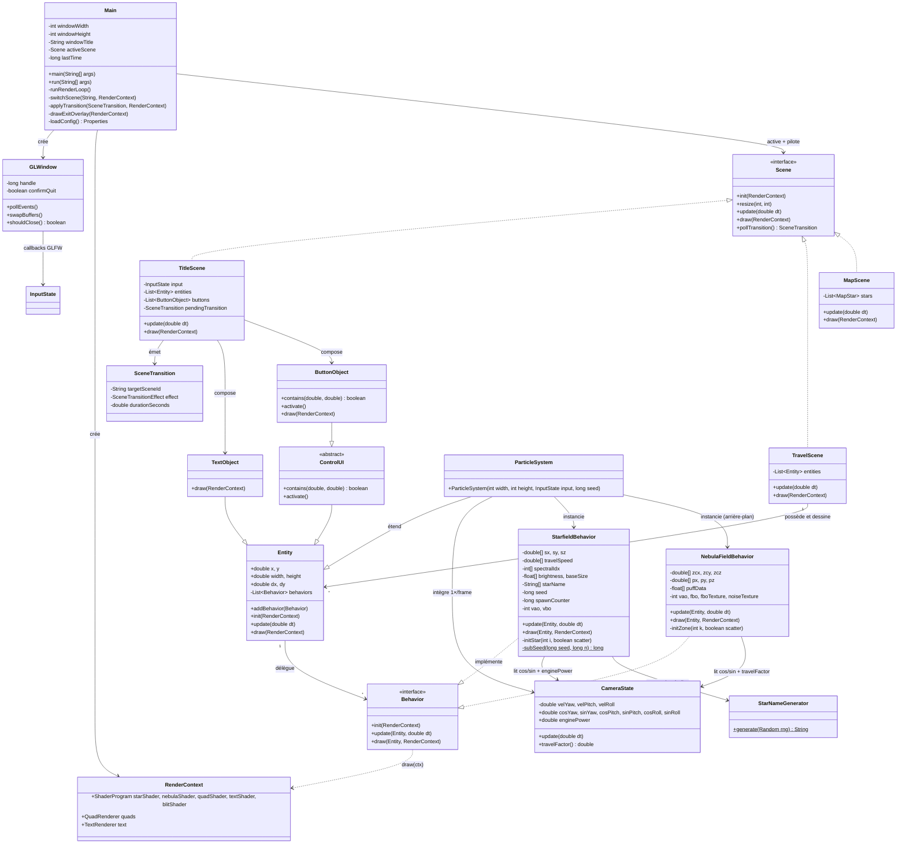
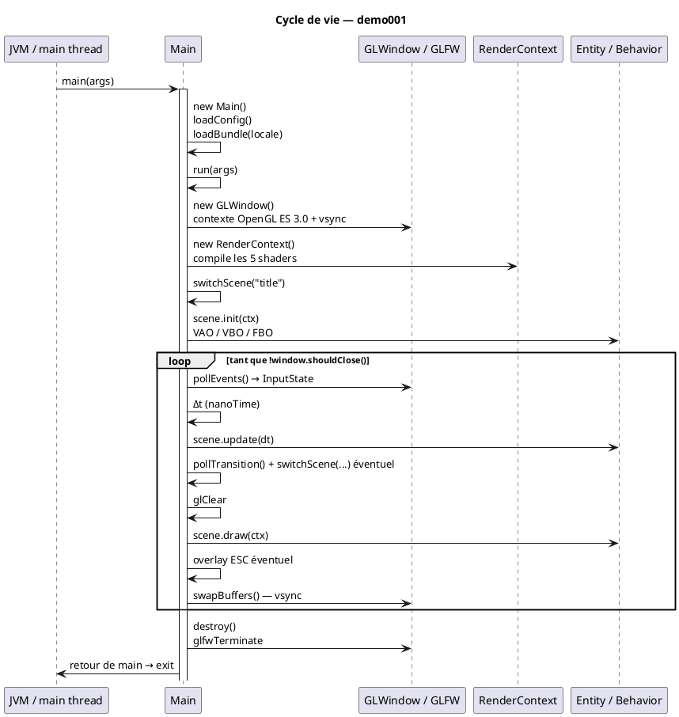
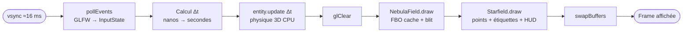

# Chapitre 1 — Architecture générale

## Vue d'ensemble

**demo001** est une application de bureau Java qui anime un champ d'étoiles 3D en vol
continu, rendue en **OpenGL ES 3.0** via LWJGL 3 (fenêtre GLFW, shaders GLSL — voir
[chapitre 12](12-opengl-pipeline.md)). Elle est compilée avec Java 26 et packagée via
un script `build.sh` maison qui télécharge les jars LWJGL dans `lib/`.

L'architecture repose sur cinq couches :

1. **Infrastructure applicative** (`Main`, `GLWindow`) — chargement de la configuration,
   localisation, fenêtre GLFW + contexte GL et boucle de jeu.
2. **Gestion de scènes** (`Scene`, `TitleScene`, `TravelScene`, `MapScene`, `SceneTransition`,
   `TextObject`, `ControlUI`, `ButtonObject`) —
    découpage des écrans, cycle de vie et navigation.
3. **Infrastructure de rendu** (`RenderContext`, `ShaderProgram`, `QuadRenderer`,
   `TextRenderer`) — shaders partagés et primitives HUD.
4. **Modèle de scène** (`Entity`, `Behavior`) — graphe d'objets génériques avec composition
   de comportements.
5. **Comportements métier** (`ParticleSystem`, `StarfieldBehavior`,
   `NebulaFieldBehavior`) — simulation physique et rendu.

---

## Diagramme de classes

---

## Cycle de vie de l'application

---

## Flux de données par frame

---

## Configuration et internationalisation

Au démarrage, `Main` charge deux ressources depuis le classpath :

| Ressource | Rôle |
|-----------|------|
| `/config.properties` | Dimensions de la fenêtre, code de langue |
| `i18n/messages_*.properties` | Titre localisé de la fenêtre |

Les codes de langue supportés sont **EN**, **FR**, **DE**, **ES**, **IT**.
La locale est construite via `Locale.of(langCode.toLowerCase())` et passée à
`ResourceBundle.getBundle("i18n.messages", locale)`.

---

> Chapitres suivants :
> - [02 — Pattern Entity / Behavior](02-entity-behavior.md)
> - [03 — ParticleSystem](03-particle-system.md)
> - [07 — Boucle de jeu](07-game-loop.md)
> - [12 — Pipeline OpenGL](12-opengl-pipeline.md)
