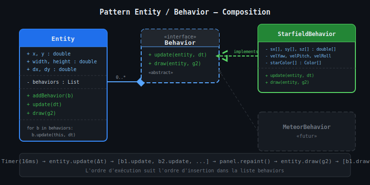
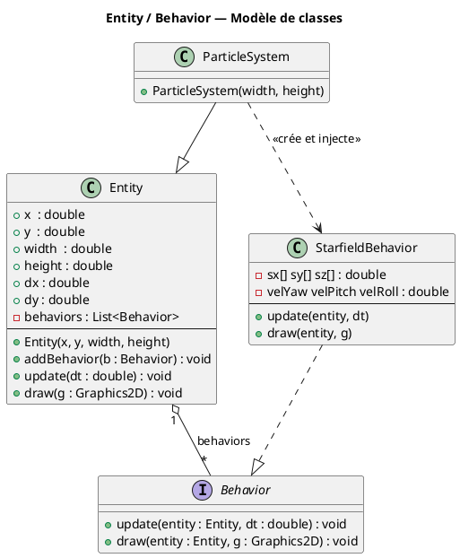
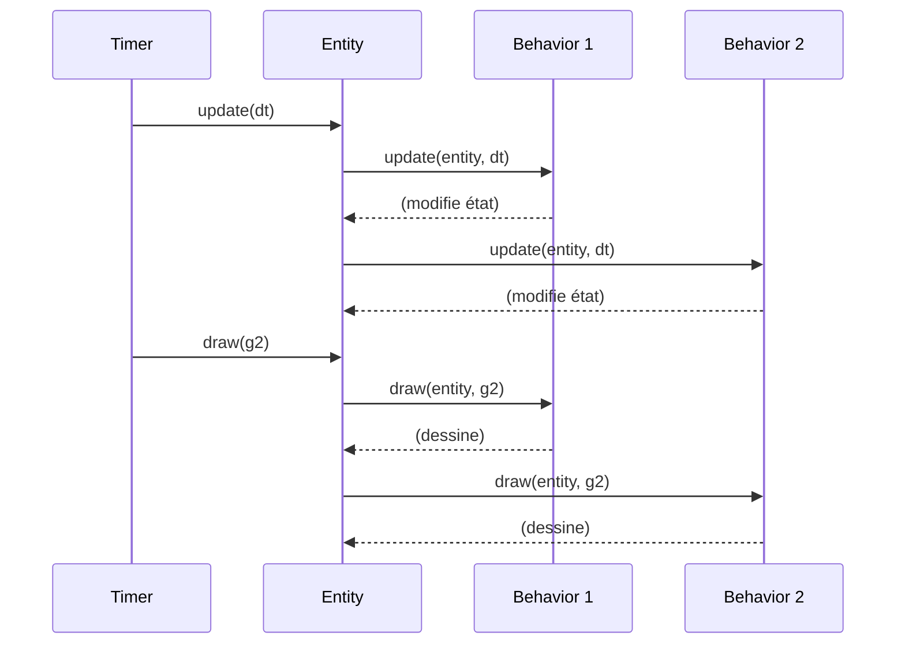

# Chapitre 2 — Pattern Entity / Behavior

## Motivation : composition plutôt qu'héritage

Un moteur de jeu naïf modélise ses objets par héritage :
`Etoile extends ObjetRendu extends Objet3D`. Cette hiérarchie rigide pose problème dès
qu'un objet doit cumuler plusieurs capacités indépendantes (rendu, physique, IA…).

Le pattern **Entity / Behavior** (ou *Component* dans la littérature Unity/ECS) inverse
la logique : une `Entity` est un **conteneur vide** auquel on attache dynamiquement des
`Behavior`. Chaque `Behavior` encapsule une responsabilité unique et ne connaît pas les
autres. L'entité délègue simplement `update` et `draw` à tous ses comportements dans
l'ordre d'insertion.



---

## Diagramme UML de classes



---

## Protocole update / draw

Chaque frame, la boucle de jeu appelle successivement `update(dt)` puis `draw(g2)`
sur chaque `Entity`. L'entité propage ces appels à la liste de ses `Behavior` :



---

## Code source — Entity

```java
public class Entity {
    public double x, y, width, height, dx, dy;
    private final List<Behavior> behaviors = new ArrayList<>();

    public Entity(double x, double y, double width, double height) {
        this.x = x; this.y = y;
        this.width = width; this.height = height;
    }

    public void addBehavior(Behavior b) { behaviors.add(b); }

    public void update(double dt) {
        for (Behavior b : behaviors) b.update(this, dt);
    }

    public void draw(Graphics2D g) {
        for (Behavior b : behaviors) b.draw(this, g);
    }
}
```

---

## Code source — interface Behavior

```java
public interface Behavior {
    void update(Entity entity, double dt);
    void draw(Entity entity, Graphics2D g);
}
```

---

## Avantages du pattern dans ce projet

| Critère | Héritage seul | Entity + Behavior |
|---------|--------------|-------------------|
| Ajout d'un nouveau comportement | Sous-classe | `new MyBehavior()` + `addBehavior()` |
| Cumul de comportements | Héritage multiple interdit en Java | Liste illimitée |
| Testabilité | Dépendances couplées | Chaque `Behavior` est testable isolément |
| Réutilisation | Hiérarchie figée | Un `Behavior` partageable entre `Entity` différentes |

---

> Voir aussi :
> - [03 — ParticleSystem](03-particle-system.md) — utilisation concrète du pattern
> - [05 — Rotations 3D](05-rotations-3d.md) — logique interne de `StarfieldBehavior.update`
