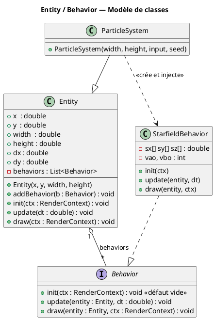

# Chapitre 2 — Pattern Entity / Behavior

## Motivation : composition plutôt qu'héritage

Un moteur de jeu naïf modélise ses objets par héritage :
`Etoile extends ObjetRendu extends Objet3D`. Cette hiérarchie rigide pose problème dès
qu'un objet doit cumuler plusieurs capacités indépendantes (rendu, physique, IA…).

Le pattern **Entity / Behavior** (ou *Component* dans la littérature Unity/ECS) inverse
la logique : une `Entity` est un **conteneur vide** auquel on attache dynamiquement des
`Behavior`. Chaque `Behavior` encapsule une responsabilité unique et ne connaît pas les
autres. L'entité délègue simplement `update` et `draw` à tous ses comportements dans
l'ordre d'insertion.


---

## Diagramme UML de classes



---

## Protocole init / update / draw

Au démarrage, la boucle de jeu appelle une fois `init(ctx)` (création des
ressources GL : VAO, VBO, FBO). Ensuite, chaque frame appelle `update(dt)` puis
`draw(ctx)` sur chaque `Entity`, qui propage à la liste de ses `Behavior` —
l'ordre d'insertion est donc aussi l'ordre de superposition visuelle :

```mermaid
sequenceDiagram
    participant Loop as Boucle GLFW
    participant Entity
    participant B1 as Behavior 1
    participant B2 as Behavior 2

    Loop->>Entity: init(ctx)
    Entity->>B1: init(ctx)
    Entity->>B2: init(ctx)

    Loop->>Entity: update(dt)
    Entity->>B1: update(entity, dt)
    B1-->>Entity: (modifie état)
    Entity->>B2: update(entity, dt)
    B2-->>Entity: (modifie état)

    Loop->>Entity: draw(ctx)
    Entity->>B1: draw(entity, ctx)
    B1-->>Entity: (dessine — arrière-plan)
    Entity->>B2: draw(entity, ctx)
    B2-->>Entity: (dessine — premier plan)
```

---

## Code source — Entity

```java
public class Entity {
    public double x, y, width, height, dx, dy;
    private final List<Behavior> behaviors = new ArrayList<>();

    public Entity(double x, double y, double width, double height) {
        this.x = x; this.y = y;
        this.width = width; this.height = height;
    }

    public void addBehavior(Behavior b) { behaviors.add(b); }

    public void init(RenderContext ctx) {
        for (Behavior b : behaviors) b.init(ctx);
    }

    public void update(double dt) {
        for (Behavior b : behaviors) b.update(this, dt);
    }

    public void draw(RenderContext ctx) {
        for (Behavior b : behaviors) b.draw(this, ctx);
    }
}
```

---

## Code source — interface Behavior

```java
public interface Behavior {
    void update(Entity entity, double dt);

    /** One-time GL resource creation (VBOs, textures); GL context is current. */
    default void init(RenderContext ctx) {}

    void draw(Entity entity, RenderContext ctx);
}
```

`RenderContext` (voir [chapitre 12](12-opengl-pipeline.md)) remplace l'ancien
`Graphics2D` : il porte les shaders partagés et les aides de dessin HUD
(`QuadRenderer`, `TextRenderer`). `init` a une implémentation par défaut vide
pour ne pas imposer de ressources GL aux comportements purement logiques.

---

## Avantages du pattern dans ce projet

| Critère | Héritage seul | Entity + Behavior |
|---------|--------------|-------------------|
| Ajout d'un nouveau comportement | Sous-classe | `new MyBehavior()` + `addBehavior()` |
| Cumul de comportements | Héritage multiple interdit en Java | Liste illimitée |
| Testabilité | Dépendances couplées | Chaque `Behavior` est testable isolément |
| Réutilisation | Hiérarchie figée | Un `Behavior` partageable entre `Entity` différentes |

---

> Voir aussi :
> - [03 — ParticleSystem](03-particle-system.md) — utilisation concrète du pattern
> - [05 — Rotations 3D](05-rotations-3d.md) — logique interne de `StarfieldBehavior.update`
