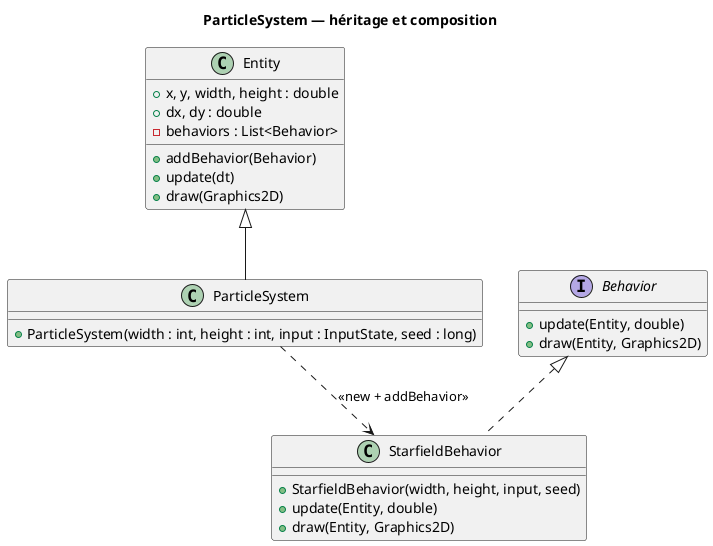
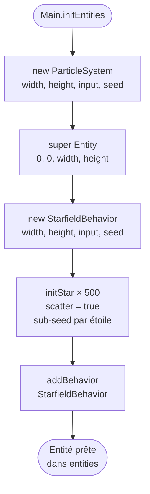

# Chapitre 3 — ParticleSystem

## Rôle

`ParticleSystem` est une **spécialisation d'`Entity`** dont le seul rôle est d'assembler
un système de particules prêt à l'emploi. Elle ne contient aucune logique de simulation
propre : tout le travail est délégué à un `Behavior` injecté dans son constructeur.

Ce design respecte le principe de **responsabilité unique** : `ParticleSystem` sait
*quels comportements* assembler ; `StarfieldBehavior` sait *comment* simuler et dessiner.

---

## Héritage et composition



---

## Flux d'initialisation



---

## Code source

```java
public class ParticleSystem extends Entity {
    public ParticleSystem(int width, int height, InputState input, long seed) {
        super(0, 0, width, height);
        addBehavior(new StarfieldBehavior(width, height, input, seed));
    }
}
```

Le paramètre `seed` provient de `config.properties` (`app.stars.seed`) et pilote toute
la génération procédurale du champ d'étoiles — positions, types spectraux et noms
(voir [10 — Génération procédurale](10-procedural-generation.md)).

La position `(0, 0)` et les dimensions `(width, height)` définissent le **domaine de
l'entité** — ici la totalité du panneau graphique. `StarfieldBehavior` lit ces valeurs
via `entity.width` / `entity.height` pour calculer les centres de projection `cx`, `cy`
et les facteurs d'échelle `projScaleX`, `projScaleY`.

---

## Extension possible

Pour ajouter un deuxième effet visuel (ex. météores, nébuleuse), il suffit d'un second
`addBehavior(...)` — sans modifier `Entity` ni `ParticleSystem` :

```java
public class ParticleSystem extends Entity {
    public ParticleSystem(int width, int height, InputState input, long seed) {
        super(0, 0, width, height);
        addBehavior(new StarfieldBehavior(width, height, input, seed));
        addBehavior(new MeteorBehavior(width, height)); // futur comportement
    }
}
```

Les deux `Behavior` seront appelés séquentiellement à chaque frame, dans l'ordre
d'insertion.

---

> Voir aussi :
> - [02 — Pattern Entity / Behavior](02-entity-behavior.md)
> - [04 — Classification spectrale](04-spectral-classification.md)
> - [05 — Rotations 3D](05-rotations-3d.md)
