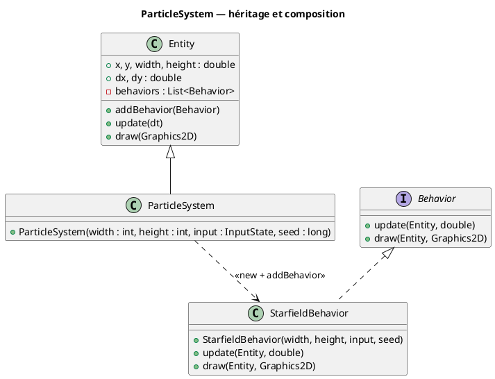
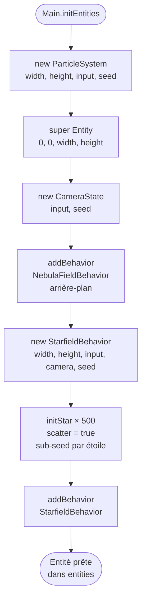

# Chapitre 3 — ParticleSystem

## Rôle

`ParticleSystem` est une **spécialisation d'`Entity`** dont le seul rôle est d'assembler
un système de particules prêt à l'emploi. Elle ne contient aucune logique de simulation
propre : tout le travail est délégué à un `Behavior` injecté dans son constructeur.

Ce design respecte le principe de **responsabilité unique** : `ParticleSystem` sait
*quels comportements* assembler ; `StarfieldBehavior` sait *comment* simuler et dessiner.

---

## Héritage et composition



---

## Flux d'initialisation



---

## Code source

```java
public class ParticleSystem extends Entity {

    private final CameraState camera;

    public ParticleSystem(int width, int height, InputState input, long seed) {
        super(0, 0, width, height);
        camera = new CameraState(input, seed);
        // Insertion order = draw order: nebulae behind, starfield in front
        addBehavior(new NebulaFieldBehavior(width, height, camera, seed));
        addBehavior(new StarfieldBehavior(width, height, input, camera, seed));
    }

    @Override
    public void update(double dt) {
        camera.update(dt);   // one camera integration per frame, before all behaviors
        super.update(dt);
    }
}
```

Le paramètre `seed` provient de `config.properties` (`app.stars.seed`) et pilote toute
la génération procédurale — champ d'étoiles, noms et nébuleuses de fond
(voir [10 — Génération procédurale](10-procedural-generation.md) et
[11 — Nébuleuses volumétriques](11-nebula-field.md)).

`ParticleSystem` illustre désormais pleinement le pattern : **l'ordre d'insertion des
`Behavior` est l'ordre de dessin** (les nébuleuses derrière, les étoiles devant), et
l'état partagé entre couches (`CameraState` : rotation et poussée moteur) est intégré
une seule fois par frame dans `update()` avant la mise à jour des comportements.

La position `(0, 0)` et les dimensions `(width, height)` définissent le **domaine de
l'entité** — ici la totalité du panneau graphique. `StarfieldBehavior` lit ces valeurs
via `entity.width` / `entity.height` pour calculer les centres de projection `cx`, `cy`
et les facteurs d'échelle `projScaleX`, `projScaleY`.

---

## Extension possible

Ce mécanisme d'extension est déjà exploité : `NebulaFieldBehavior` a été ajouté
comme couche d'arrière-plan **sans modifier `Entity` ni `StarfieldBehavior`**
(voir [chapitre 11](11-nebula-field.md)). Tout effet supplémentaire (météores,
poussière, vaisseaux…) suit le même schéma :

```java
addBehavior(new MeteorBehavior(width, height, camera, seed)); // futur comportement
```

Les `Behavior` sont appelés séquentiellement à chaque frame, dans l'ordre
d'insertion — qui détermine aussi la superposition visuelle.

---

> Voir aussi :
> - [02 — Pattern Entity / Behavior](02-entity-behavior.md)
> - [04 — Classification spectrale](04-spectral-classification.md)
> - [05 — Rotations 3D](05-rotations-3d.md)
