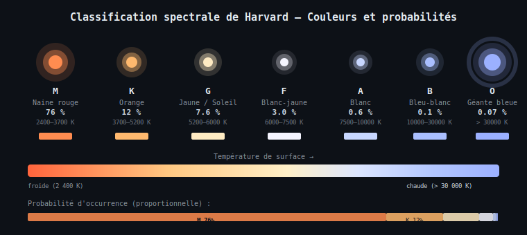
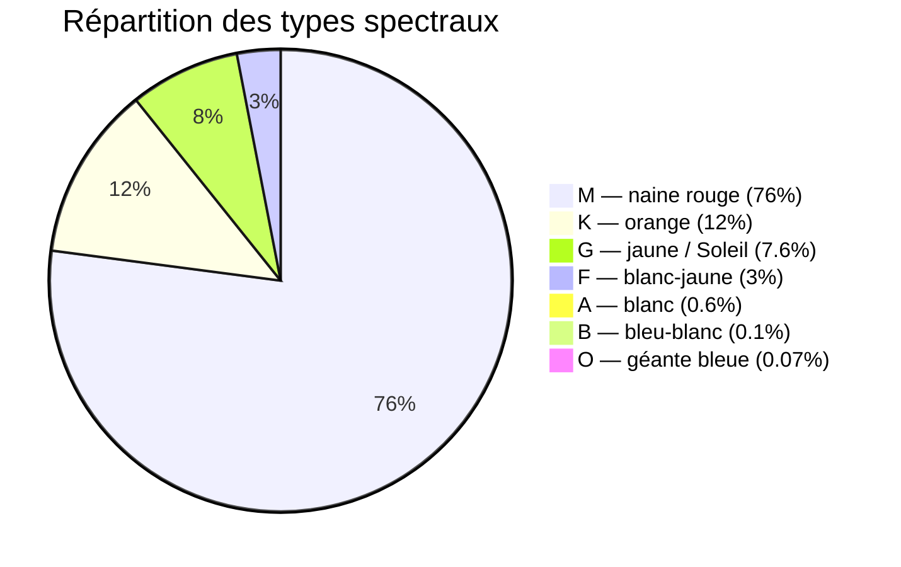

# Chapitre 4 — Classification spectrale de Harvard

## Contexte astrophysique

La **classification spectrale de Harvard** ordonne les étoiles de la plus chaude à la
plus froide selon la lettre : **O B A F G K M** (mnémotechnique anglophone :
*"Oh Be A Fine Girl/Guy, Kiss Me"*). Chaque type correspond à une plage de température
de surface et donc à une couleur dominante.

Dans `StarfieldBehavior`, chaque étoile se voit attribuer un type spectral tiré
aléatoirement selon les **fréquences d'occurrence réelles** de la Voie Lactée.



---

## Table des types spectraux

| Type | Température (K) | Couleur perçue | RGB dans le code | Prob. cumulée | Part relative |
|------|----------------|---------------|-----------------|--------------|--------------|
| M | 2 400 – 3 700 | Rouge-orangé | (255, 140, 80) | 0.760 | 76,0 % |
| K | 3 700 – 5 200 | Orange | (255, 185, 110) | 0.880 | 12,0 % |
| G | 5 200 – 6 000 | Jaune (Soleil) | (255, 235, 195) | 0.956 | 7,6 % |
| F | 6 000 – 7 500 | Blanc-jaune | (245, 245, 255) | 0.986 | 3,0 % |
| A | 7 500 – 10 000 | Blanc | (200, 215, 255) | 0.992 | 0,6 % |
| B | 10 000 – 30 000 | Bleu-blanc | (170, 191, 255) | 0.993 | 0,1 % |
| O | > 30 000 | Bleu intense | (155, 176, 255) | 1.000 | 0,07 % |

---

## Diagramme de répartition



---

## Tirage aléatoire par probabilité cumulée

La méthode `initStar` tire un réel $r \in [0, 1[$ uniformément, puis parcourt le tableau
`SPECTRAL_TYPES` en ordre croissant de probabilité cumulée $p_i$ jusqu'à trouver
$r < p_i$ :

$$r \sim \mathcal{U}(0,1), \quad \text{type} = \min\{i \mid r < p_i\}$$

En notation MathML :

```xml
<math xmlns="http://www.w3.org/1998/Math/MathML">
  <mrow>
    <mi>type</mi>
    <mo>=</mo>
    <mo>argmin</mo>
    <mrow><mi>i</mi></mrow>
    <mrow>
      <mo>{</mo>
      <mi>i</mi>
      <mo>|</mo>
      <mi>r</mi>
      <mo>&lt;</mo>
      <msub><mi>p</mi><mi>i</mi></msub>
      <mo>}</mo>
    </mrow>
    <mo>,</mo>
    <mspace width="1em"/>
    <mi>r</mi>
    <mo>~</mo>
    <mi mathvariant="script">U</mi>
    <mo>(</mo><mn>0</mn><mo>,</mo><mn>1</mn><mo>)</mo>
  </mrow>
</math>
```

---

## Luminosité et taille de base

Chaque type spectral définit une **luminosité minimale** `minBrightness` et une
**taille de base** `baseSizePx`. La valeur finale est modulée aléatoirement :

$$\text{brightness}_i = b_{\min} + r_1 \cdot (1 - b_{\min}), \quad r_1 \sim \mathcal{U}(0,1)$$

$$\text{baseSize}_i = s_{\text{base}} \cdot (0.7 + r_2 \cdot 0.6), \quad r_2 \sim \mathcal{U}(0,1)$$

Les étoiles de type **O** et **B** ont une taille de base plus grande (5,0 et 3,6 px)
et une luminosité minimale proche de 1,0 — ce qui leur donne un halo de diffusion
visible (voir chapitre 6 — Projection perspective).

---

## Extrait de code

```java
// Harvard spectral classification: {cumProb, R, G, B, minBrightness, baseSizePx}
private static final double[][] SPECTRAL_TYPES = {
    {0.760, 255, 140,  80, 0.35, 1.1},  // M — naine rouge      (76 %)
    {0.880, 255, 185, 110, 0.50, 1.5},  // K — orange            (12 %)
    {0.956, 255, 235, 195, 0.65, 2.0},  // G — jaune, Soleil     ( 7.6 %)
    {0.986, 245, 245, 255, 0.75, 2.4},  // F — blanc-jaune       ( 3.0 %)
    {0.992, 200, 215, 255, 0.85, 2.9},  // A — blanc             ( 0.6 %)
    {0.993, 170, 191, 255, 0.93, 3.6},  // B — bleu-blanc        ( 0.1 %)
    {1.000, 155, 176, 255, 1.00, 5.0},  // O — géante bleue      (rarest)
};
```

---

> Voir aussi :
> - [05 — Rotations 3D](05-rotations-3d.md)
> - [06 — Projection perspective et rendu](06-perspective-projection.md)
