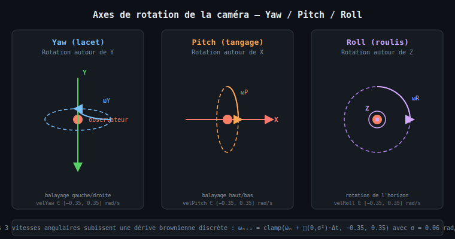

# Chapitre 5 — Rotations 3D : Yaw, Pitch, Roll

## Les trois axes de la caméra

Le champ d'étoiles est fixe dans l'espace 3D ; c'est la **caméra** qui se déplace.
Pour simuler le mouvement de la caméra, on applique à chaque étoile l'inverse de la
rotation caméra — ce qui revient à faire tourner tout le champ d'étoiles autour de
l'observateur.

Trois rotations sont combinées à chaque frame :

| Rotation | Axe | Variable | Effet visuel |
|----------|-----|----------|-------------|
| **Yaw** (lacet) | Y | `velYaw` | Balayage gauche/droite |
| **Pitch** (tangage) | X | `velPitch` | Balayage haut/bas |
| **Roll** (roulis) | Z | `velRoll` | Rotation de l'horizon |



---

## Matrices de rotation

### Rotation autour de Y (Yaw — angle $\alpha_Y$)

$$R_Y(\alpha_Y) = \begin{pmatrix} \cos\alpha_Y & 0 & \sin\alpha_Y \\ 0 & 1 & 0 \\ -\sin\alpha_Y & 0 & \cos\alpha_Y \end{pmatrix}$$

```xml
<math xmlns="http://www.w3.org/1998/Math/MathML">
  <msub><mi>R</mi><mi>Y</mi></msub>
  <mo>=</mo>
  <mrow>
    <mo>(</mo>
    <mtable>
      <mtr>
        <mtd><mo>cos</mo><mi>α</mi></mtd>
        <mtd><mn>0</mn></mtd>
        <mtd><mo>sin</mo><mi>α</mi></mtd>
      </mtr>
      <mtr>
        <mtd><mn>0</mn></mtd>
        <mtd><mn>1</mn></mtd>
        <mtd><mn>0</mn></mtd>
      </mtr>
      <mtr>
        <mtd><mo>-</mo><mo>sin</mo><mi>α</mi></mtd>
        <mtd><mn>0</mn></mtd>
        <mtd><mo>cos</mo><mi>α</mi></mtd>
      </mtr>
    </mtable>
    <mo>)</mo>
  </mrow>
</math>
```

### Rotation autour de X (Pitch — angle $\alpha_P$)

$$R_X(\alpha_P) = \begin{pmatrix} 1 & 0 & 0 \\ 0 & \cos\alpha_P & -\sin\alpha_P \\ 0 & \sin\alpha_P & \cos\alpha_P \end{pmatrix}$$

### Rotation autour de Z (Roll — angle $\alpha_R$)

$$R_Z(\alpha_R) = \begin{pmatrix} \cos\alpha_R & -\sin\alpha_R & 0 \\ \sin\alpha_R & \cos\alpha_R & 0 \\ 0 & 0 & 1 \end{pmatrix}$$

### Application composée

Les trois rotations sont appliquées **séquentiellement** (non sous forme d'une matrice
$4{\times}4$ composée, pour éviter l'allocation d'objet dans la boucle chaude) :

$$\mathbf{p}' = R_Z(\alpha_R) \cdot R_X(\alpha_P) \cdot R_Y(\alpha_Y) \cdot \mathbf{p}$$

---

## Contrôle des vitesses angulaires — mode hybride

Les vitesses angulaires $\omega_Y$, $\omega_P$, $\omega_R$ (en rad/s) sont gérées selon
trois modes exclusifs, par ordre de priorité (voir [chapitre 8](08-input-controls.md)) :

1. **Frein** (SPACE) — décroissance exponentielle vers zéro.
2. **Contrôle utilisateur** (flèches / WASD / Q-E / souris) — lerp vers une cible.
3. **Dérive brownienne** (aucune entrée) — mouvement de Wiener discrétisé :

$$\omega_{n+1} = \text{clamp}\!\left(\omega_n + \mathcal{N}(0,\,\sigma^2)\cdot\Delta t,\; -\omega_{\max},\; \omega_{\max}\right)$$

avec $\sigma = 0.06\ \text{rad/s}^2$ (`DRIFT_ACC`) et $\omega_{\max} = 0.35\ \text{rad/s}$ (`MAX_VEL`).

```xml
<math xmlns="http://www.w3.org/1998/Math/MathML">
  <msub><mi>ω</mi><mrow><mi>n</mi><mo>+</mo><mn>1</mn></mrow></msub>
  <mo>=</mo>
  <mo>clamp</mo>
  <mo>(</mo>
  <msub><mi>ω</mi><mi>n</mi></msub>
  <mo>+</mo>
  <mi mathvariant="script">N</mi>
  <mo>(</mo><mn>0</mn><mo>,</mo><msup><mi>σ</mi><mn>2</mn></msup><mo>)</mo>
  <mo>·</mo>
  <mi>Δt</mi>
  <mo>,</mo>
  <mo>-</mo><msub><mi>ω</mi><mi>max</mi></msub>
  <mo>,</mo>
  <msub><mi>ω</mi><mi>max</mi></msub>
  <mo>)</mo>
</math>
```

Ce mécanisme produit une trajectoire douce et imprévisible — sans chocs brusques — qui
donne l'illusion d'un vaisseau spatial dérivant librement lorsqu'aucune entrée n'est active.

---

## Avancement vers la caméra (forward travel)

En plus des rotations, chaque étoile avance vers l'observateur. La vitesse d'approche
est **inversement proportionnelle à $z$** (effet parallaxe + warp hyperspeed) :

$$z_{n+1} = z_n - \frac{v_{\text{base}} \cdot v_i}{z_n} \cdot \Delta t$$

avec $v_{\text{base}} = 0.20$ (`TRAVEL_SPEED`) et $v_i \in [0.4, 1.6]$ le multiplicateur
par étoile (`travelSpeed[i]`).

Quand $z \le z_{\min}$ (`NEAR_Z = 0.06`), l'étoile est **respawnée** à profondeur lointaine
($z \in [0.7 \times \text{RANGE},\; \text{RANGE}]$), simulant l'arrivée de nouvelles
étoiles de l'infini.

---

## Flowchart de la boucle update

```mermaid
flowchart TD
    A([update dt]) --> B{Mode ?}
    B -- Frein SPACE --> C[Décroissance exponentielle\nω *= max(0, 1−8·dt)]
    B -- Clavier/Souris --> D[Lerp vers cible ω*\nω += (ω*-ω)·4·dt]
    B -- Aucune entrée --> E[Bruit gaussien brownien\nω += N·dt, clamp ±0.35]
    C --> F[Calcul angles frame\nα = vel × dt]
    D --> F
    E --> F
    F --> G[Précalcul cos/sin\npour les 3 axes]
    G --> H{Pour chaque\nétoile i}
    H --> I[Rotation Yaw\nautour de Y]
    I --> J[Rotation Pitch\nautour de X]
    J --> K[Rotation Roll\nautour de Z]
    K --> L[Forward travel\nz -= speed/z × dt]
    L --> M{z ≤ NEAR_Z ?}
    M -- oui --> N[initStar\nrespawn lointain]
    M -- non --> H
    N --> H
```

---

## Extrait de code — update

```java
// Dérive brownienne
velYaw   += rng.nextGaussian() * DRIFT_ACC * dt;
velPitch += rng.nextGaussian() * DRIFT_ACC * dt;
velRoll  += rng.nextGaussian() * DRIFT_ACC * dt;
velYaw   = Math.clamp(velYaw,   -MAX_VEL, MAX_VEL);

double ay = velYaw * dt, ap = velPitch * dt, ar = velRoll * dt;
double cosY = Math.cos(ay), sinY = Math.sin(ay);
// ...

// Yaw — rotation around Y axis
double tx = x * cosY + z * sinY;
double tz = -x * sinY + z * cosY;
x = tx; z = tz;
// + Pitch, Roll de manière similaire...

// Forward travel
z -= TRAVEL_SPEED * travelSpeed[i] / z * dt;
```

---

> Voir aussi :
> - [06 — Projection perspective et rendu](06-perspective-projection.md)
> - [04 — Classification spectrale](04-spectral-classification.md)
