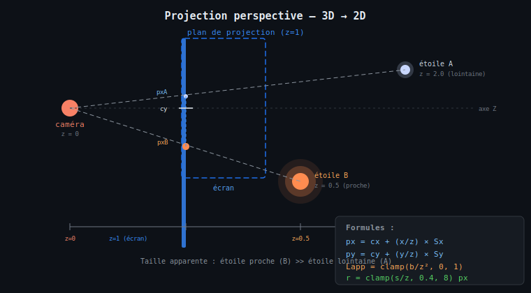
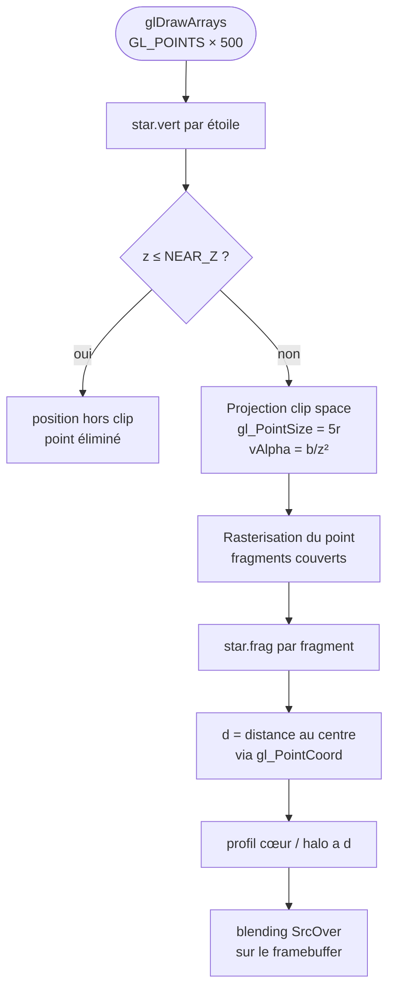

# Chapitre 6 — Projection perspective et rendu

## De la 3D à l'écran

Une fois les coordonnées 3D $(x, y, z)$ de chaque étoile mises à jour par la physique,
il faut les **projeter sur le plan 2D** de l'écran. La technique utilisée est la
**projection en perspective centrale** (ou projection conique), qui produit l'effet
de profondeur naturel : plus une étoile est proche ($z$ petit), plus elle apparaît
grande et se déplace rapidement vers le bord.



---

## Formule de projection

Le plan de projection est centré sur le milieu de la fenêtre (`cx`, `cy`).
Les facteurs d'échelle `projScaleX = width * 0.45` et `projScaleY = height * 0.45`
contrôlent l'ouverture angulaire du champ de vision :

$$p_x = c_x + \frac{x}{z} \cdot S_x \qquad p_y = c_y + \frac{y}{z} \cdot S_y$$

```xml
<math xmlns="http://www.w3.org/1998/Math/MathML">
  <mrow>
    <msub><mi>p</mi><mi>x</mi></msub>
    <mo>=</mo>
    <msub><mi>c</mi><mi>x</mi></msub>
    <mo>+</mo>
    <mfrac>
      <mi>x</mi>
      <mi>z</mi>
    </mfrac>
    <mo>·</mo>
    <msub><mi>S</mi><mi>x</mi></msub>
  </mrow>
  <mo>,</mo>
  <mspace width="2em"/>
  <mrow>
    <msub><mi>p</mi><mi>y</mi></msub>
    <mo>=</mo>
    <msub><mi>c</mi><mi>y</mi></msub>
    <mo>+</mo>
    <mfrac>
      <mi>y</mi>
      <mi>z</mi>
    </mfrac>
    <mo>·</mo>
    <msub><mi>S</mi><mi>y</mi></msub>
  </mrow>
</math>
```

Plus $z$ est grand (étoile lointaine), plus $x/z$ est petit → l'étoile apparaît près
du centre. Plus $z \to 0$ (étoile proche), plus le rapport $x/z$ grandit → l'étoile
file vers le bord de l'écran, créant l'effet de warp.

---

## Luminosité apparente — loi en inverse du carré

La luminosité apparente décroît avec le carré de la distance selon la **loi photométrique** :

$$L_{\text{app}} = \text{clamp}\!\left(\frac{b_i}{z^2},\; 0,\; 1\right)$$

avec $b_i$ la luminosité intrinsèque de l'étoile (issue de la classification spectrale).

```xml
<math xmlns="http://www.w3.org/1998/Math/MathML">
  <msub><mi>L</mi><mi>app</mi></msub>
  <mo>=</mo>
  <mo>clamp</mo>
  <mo>(</mo>
  <mfrac>
    <msub><mi>b</mi><mi>i</mi></msub>
    <msup><mi>z</mi><mn>2</mn></msup>
  </mfrac>
  <mo>,</mo>
  <mn>0</mn>
  <mo>,</mo>
  <mn>1</mn>
  <mo>)</mo>
</math>
```

La valeur alpha du pixel est $\alpha = \lfloor L_{\text{app}} \times 255 \rfloor$.
Les étoiles dont $\alpha < 8$ sont ignorées (étoile trop lointaine ou trop faible).

---

## Rayon apparent — perspective

La taille visuelle d'une étoile décroît également avec $z$ :

$$r = \text{clamp}\!\left(\frac{s_i}{z},\; 0.4,\; 8\right) \text{ px}$$

```xml
<math xmlns="http://www.w3.org/1998/Math/MathML">
  <mi>r</mi>
  <mo>=</mo>
  <mo>clamp</mo>
  <mo>(</mo>
  <mfrac>
    <msub><mi>s</mi><mi>i</mi></msub>
    <mi>z</mi>
  </mfrac>
  <mo>,</mo>
  <mn>0.4</mn>
  <mo>,</mo>
  <mn>8</mn>
  <mo>)</mo>
</math>
```

---

## Rendu par shaders : projection et profil radial sur la carte graphique

Depuis la migration OpenGL ([chapitre 12](12-opengl-pipeline.md)), toutes les
formules de ce chapitre s'exécutent dans la paire de shaders `star.vert` /
`star.frag`. Chaque étoile est un **point sprite** (`GL_POINTS`) : la position
3D, la taille de base, la brillance intrinsèque et la couleur spectrale partent
dans un VBO (8 floats par étoile, ré-uploadé chaque frame), et un unique
`glDrawArrays(GL_POINTS, 0, 500)` dessine tout le champ.

### Vertex shader — projection, taille, brillance

```glsl
vec2 px   = vec2(aPos.x / z * uProjScale.x, aPos.y / z * uProjScale.y);
vec2 clip = px / (uViewport * 0.5);
gl_Position = vec4(clip.x, -clip.y, 0.0, 1.0);   // y inversé (OpenGL pointe vers le haut)

vAlpha = clamp(aBrightness / (z * z), 0.0, 1.0); // loi en carré inverse
float r = clamp(aSize / z, 0.4, 8.0);            // rayon perspective
gl_PointSize = r * 2.5 * 2.0;                    // le point couvre le halo entier
```

La luminosité apparente n'est plus quantifiée : $L_{\text{app}} = b/z^2$ est
calculée en continu par vertex, sans table de sprites.

### Fragment shader — cœur + halo dans le même profil

Le profil radial reprend les arrêts de l'ancien dégradé : **cœur** opaque sur la
fraction intérieure $1/2.5$ du rayon, chute rapide vers un **halo** à ~21 %,
extinction au bord — évalué par pixel grâce à `gl_PointCoord` :

$$
a(d) = \begin{cases}
1 & d < 0.9\,c \\
\text{mix}(1,\, 0.235,\, \frac{d - 0.9c}{0.25c}) & d < 1.15\,c \\
\text{mix}(0.235,\, 0,\, \frac{d - 1.15c}{1 - 1.15c}) & \text{sinon}
\end{cases}
\qquad c = \frac{1}{2.5}
$$

<math xmlns="http://www.w3.org/1998/Math/MathML" display="block">
  <mrow>
    <mtext>fragColor</mtext>
    <mo>=</mo>
    <mo>(</mo>
    <msub><mi>c</mi><mtext>rgb</mtext></msub>
    <mo>,</mo>
    <msub><mi>L</mi><mtext>app</mtext></msub>
    <mo>·</mo>
    <mi>a</mi><mo>(</mo><mi>d</mi><mo>)</mo>
    <mo>)</mo>
  </mrow>
</math>

---

## Flowchart du rendu par étoile



---

## Rendu sub-pixel

Les étoiles très lointaines ont un rayon $r < 1\ \text{px}$ : `gl_PointSize`
tombe alors autour de 2 px (le point couvre le halo, 5× le rayon du cœur), et le
profil radial n'éclaire pleinement que le fragment central — l'aspect granuleux
du ciel profond est préservé sans cas particulier dans le code, contrairement à
l'ancien chemin Java2D qui basculait sur un `fillRect` d'un pixel.

---

## Extrait de code — draw (CPU)

Côté Java, il ne reste que le remplissage du VBO et un draw call :

```java
for (int i = 0; i < STAR_COUNT; i++) {
    int o = i * FLOATS_PER_STAR;
    double[] spec = SPECTRAL_TYPES[spectralIdx[i]];
    starData[o]     = (float) sx[i];
    starData[o + 1] = (float) sy[i];
    starData[o + 2] = (float) sz[i];
    starData[o + 3] = baseSize[i];
    starData[o + 4] = brightness[i];
    starData[o + 5] = (float) (spec[1] / 255.0);   // couleur spectrale
    starData[o + 6] = (float) (spec[2] / 255.0);
    starData[o + 7] = (float) (spec[3] / 255.0);
}
ctx.starShader.use();
// uniforms : uViewport, uProjScale, uNearZ
glBufferSubData(GL_ARRAY_BUFFER, 0, starData);
glDrawArrays(GL_POINTS, 0, STAR_COUNT);
```

---

> Voir aussi :
> - [05 — Rotations 3D](05-rotations-3d.md)
> - [04 — Classification spectrale](04-spectral-classification.md)
