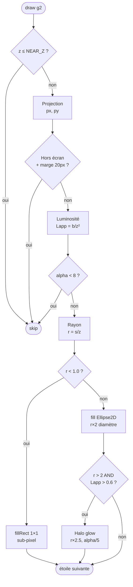

# Chapitre 6 — Projection perspective et rendu

## De la 3D à l'écran

Une fois les coordonnées 3D $(x, y, z)$ de chaque étoile mises à jour par la physique,
il faut les **projeter sur le plan 2D** de l'écran. La technique utilisée est la
**projection en perspective centrale** (ou projection conique), qui produit l'effet
de profondeur naturel : plus une étoile est proche ($z$ petit), plus elle apparaît
grande et se déplace rapidement vers le bord.


---

## Formule de projection

Le plan de projection est centré sur le milieu de la fenêtre (`cx`, `cy`).
Les facteurs d'échelle `projScaleX = width * 0.45` et `projScaleY = height * 0.45`
contrôlent l'ouverture angulaire du champ de vision :

$$p_x = c_x + \frac{x}{z} \cdot S_x \qquad p_y = c_y + \frac{y}{z} \cdot S_y$$

```xml
<math xmlns="http://www.w3.org/1998/Math/MathML">
  <mrow>
    <msub><mi>p</mi><mi>x</mi></msub>
    <mo>=</mo>
    <msub><mi>c</mi><mi>x</mi></msub>
    <mo>+</mo>
    <mfrac>
      <mi>x</mi>
      <mi>z</mi>
    </mfrac>
    <mo>·</mo>
    <msub><mi>S</mi><mi>x</mi></msub>
  </mrow>
  <mo>,</mo>
  <mspace width="2em"/>
  <mrow>
    <msub><mi>p</mi><mi>y</mi></msub>
    <mo>=</mo>
    <msub><mi>c</mi><mi>y</mi></msub>
    <mo>+</mo>
    <mfrac>
      <mi>y</mi>
      <mi>z</mi>
    </mfrac>
    <mo>·</mo>
    <msub><mi>S</mi><mi>y</mi></msub>
  </mrow>
</math>
```

Plus $z$ est grand (étoile lointaine), plus $x/z$ est petit → l'étoile apparaît près
du centre. Plus $z \to 0$ (étoile proche), plus le rapport $x/z$ grandit → l'étoile
file vers le bord de l'écran, créant l'effet de warp.

---

## Luminosité apparente — loi en inverse du carré

La luminosité apparente décroît avec le carré de la distance selon la **loi photométrique** :

$$L_{\text{app}} = \text{clamp}\!\left(\frac{b_i}{z^2},\; 0,\; 1\right)$$

avec $b_i$ la luminosité intrinsèque de l'étoile (issue de la classification spectrale).

```xml
<math xmlns="http://www.w3.org/1998/Math/MathML">
  <msub><mi>L</mi><mi>app</mi></msub>
  <mo>=</mo>
  <mo>clamp</mo>
  <mo>(</mo>
  <mfrac>
    <msub><mi>b</mi><mi>i</mi></msub>
    <msup><mi>z</mi><mn>2</mn></msup>
  </mfrac>
  <mo>,</mo>
  <mn>0</mn>
  <mo>,</mo>
  <mn>1</mn>
  <mo>)</mo>
</math>
```

La valeur alpha du pixel est $\alpha = \lfloor L_{\text{app}} \times 255 \rfloor$.
Les étoiles dont $\alpha < 8$ sont ignorées (étoile trop lointaine ou trop faible).

---

## Rayon apparent — perspective

La taille visuelle d'une étoile décroît également avec $z$ :

$$r = \text{clamp}\!\left(\frac{s_i}{z},\; 0.4,\; 8\right) \text{ px}$$

```xml
<math xmlns="http://www.w3.org/1998/Math/MathML">
  <mi>r</mi>
  <mo>=</mo>
  <mo>clamp</mo>
  <mo>(</mo>
  <mfrac>
    <msub><mi>s</mi><mi>i</mi></msub>
    <mi>z</mi>
  </mfrac>
  <mo>,</mo>
  <mn>0.4</mn>
  <mo>,</mo>
  <mn>8</mn>
  <mo>)</mo>
</math>
```

---

## Halo de diffusion (glow)

Pour les étoiles lumineuses proches (types O, B, A), un disque de diffusion est
superposé — rayon $2.5 \times r$, alpha réduit à $\approx 21\%$ de la luminosité
apparente :

$$r_{\text{glow}} = 2.5 \cdot r, \qquad \alpha_{\text{glow}} = \lfloor L_{\text{app}} \times 55 \rfloor$$

Condition de déclenchement : $r > 2.0\ \text{px}$ **ET** $L_{\text{app}} > 0.6$.

---

## Flowchart du rendu par étoile



---

## Rendu sub-pixel

Les étoiles très lointaines ont un rayon $r < 1\ \text{px}$. Plutôt que de dessiner une
ellipse d'un pixel (coûteux en anti-aliasing), on appelle `fillRect(px, py, 1, 1)` :
un simple pixel de la couleur de l'étoile avec son alpha calculé. C'est suffisant pour
restituer l'aspect granuleux du ciel profond.

---

## Extrait de code — draw

```java
double px = cx + sx[i] / z * projScaleX;
double py = cy + sy[i] / z * projScaleY;

float ab = Math.clamp((float)(brightness[i] / (z * z)), 0f, 1f);
int alpha = (int)(ab * 255);
if (alpha < 8) continue;

float r = Math.clamp((float)(baseSize[i] / z), 0.4f, 8f);
g.setColor(new Color(c.getRed(), c.getGreen(), c.getBlue(), alpha));

if (r < 1.0f) {
    g.fillRect((int) px, (int) py, 1, 1);
} else {
    g.fill(new Ellipse2D.Float((float)px - r, (float)py - r, r * 2, r * 2));
    if (r > 2.0f && ab > 0.6f) {
        float gr = r * 2.5f;
        g.setColor(new Color(c.getRed(), c.getGreen(), c.getBlue(), (int)(ab * 55)));
        g.fill(new Ellipse2D.Float((float)px - gr, (float)py - gr, gr * 2, gr * 2));
    }
}
```

---

> Voir aussi :
> - [05 — Rotations 3D](05-rotations-3d.md)
> - [04 — Classification spectrale](04-spectral-classification.md)
