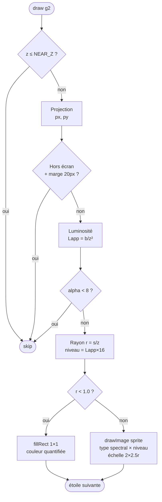

# Chapitre 6 — Projection perspective et rendu

## De la 3D à l'écran

Une fois les coordonnées 3D $(x, y, z)$ de chaque étoile mises à jour par la physique,
il faut les **projeter sur le plan 2D** de l'écran. La technique utilisée est la
**projection en perspective centrale** (ou projection conique), qui produit l'effet
de profondeur naturel : plus une étoile est proche ($z$ petit), plus elle apparaît
grande et se déplace rapidement vers le bord.


---

## Formule de projection

Le plan de projection est centré sur le milieu de la fenêtre (`cx`, `cy`).
Les facteurs d'échelle `projScaleX = width * 0.45` et `projScaleY = height * 0.45`
contrôlent l'ouverture angulaire du champ de vision :

$$p_x = c_x + \frac{x}{z} \cdot S_x \qquad p_y = c_y + \frac{y}{z} \cdot S_y$$

```xml
<math xmlns="http://www.w3.org/1998/Math/MathML">
  <mrow>
    <msub><mi>p</mi><mi>x</mi></msub>
    <mo>=</mo>
    <msub><mi>c</mi><mi>x</mi></msub>
    <mo>+</mo>
    <mfrac>
      <mi>x</mi>
      <mi>z</mi>
    </mfrac>
    <mo>·</mo>
    <msub><mi>S</mi><mi>x</mi></msub>
  </mrow>
  <mo>,</mo>
  <mspace width="2em"/>
  <mrow>
    <msub><mi>p</mi><mi>y</mi></msub>
    <mo>=</mo>
    <msub><mi>c</mi><mi>y</mi></msub>
    <mo>+</mo>
    <mfrac>
      <mi>y</mi>
      <mi>z</mi>
    </mfrac>
    <mo>·</mo>
    <msub><mi>S</mi><mi>y</mi></msub>
  </mrow>
</math>
```

Plus $z$ est grand (étoile lointaine), plus $x/z$ est petit → l'étoile apparaît près
du centre. Plus $z \to 0$ (étoile proche), plus le rapport $x/z$ grandit → l'étoile
file vers le bord de l'écran, créant l'effet de warp.

---

## Luminosité apparente — loi en inverse du carré

La luminosité apparente décroît avec le carré de la distance selon la **loi photométrique** :

$$L_{\text{app}} = \text{clamp}\!\left(\frac{b_i}{z^2},\; 0,\; 1\right)$$

avec $b_i$ la luminosité intrinsèque de l'étoile (issue de la classification spectrale).

```xml
<math xmlns="http://www.w3.org/1998/Math/MathML">
  <msub><mi>L</mi><mi>app</mi></msub>
  <mo>=</mo>
  <mo>clamp</mo>
  <mo>(</mo>
  <mfrac>
    <msub><mi>b</mi><mi>i</mi></msub>
    <msup><mi>z</mi><mn>2</mn></msup>
  </mfrac>
  <mo>,</mo>
  <mn>0</mn>
  <mo>,</mo>
  <mn>1</mn>
  <mo>)</mo>
</math>
```

La valeur alpha du pixel est $\alpha = \lfloor L_{\text{app}} \times 255 \rfloor$.
Les étoiles dont $\alpha < 8$ sont ignorées (étoile trop lointaine ou trop faible).

---

## Rayon apparent — perspective

La taille visuelle d'une étoile décroît également avec $z$ :

$$r = \text{clamp}\!\left(\frac{s_i}{z},\; 0.4,\; 8\right) \text{ px}$$

```xml
<math xmlns="http://www.w3.org/1998/Math/MathML">
  <mi>r</mi>
  <mo>=</mo>
  <mo>clamp</mo>
  <mo>(</mo>
  <mfrac>
    <msub><mi>s</mi><mi>i</mi></msub>
    <mi>z</mi>
  </mfrac>
  <mo>,</mo>
  <mn>0.4</mn>
  <mo>,</mo>
  <mn>8</mn>
  <mo>)</mo>
</math>
```

---

## Rendu par sprites : cœur + halo en un seul blit

Historiquement chaque étoile était dessinée par un ou deux `g.fill(new Ellipse2D)`
(disque + halo pour les étoiles brillantes). Or la rasterisation générique de formes
de Java2D coûte très cher en rendu logiciel : **~25 ms/frame** pour 500 étoiles sur
l'Orange Pi — impossible d'atteindre 60 FPS.

Le rendu utilise désormais des **sprites pré-rendus** : à la construction,
`makeStarSprite()` génère un dégradé radial 40×40 (`TYPE_INT_ARGB_PRE`) par
combinaison (type spectral × niveau de luminosité), soit 7 × 16 = 112 images
(~700 Ko). Le dégradé encode à la fois le **cœur** (plateau opaque sur la fraction
intérieure $1/2.5$ du rayon) et le **halo** de diffusion (chute rapide vers un
voile à ~21 % puis zéro) :

$$r_{\text{sprite}} = 2.5 \cdot r, \qquad
\text{stops} = \{0,\; 0.36,\; 0.46,\; 1\} \rightarrow
\alpha = \{255,\; 255,\; 60,\; 0\} \times \alpha_{\text{niveau}}$$

La luminosité apparente $L_{\text{app}} = b/z^2$ est **quantifiée sur 16 niveaux**
pré-cuits dans les pixels du sprite — aucun `AlphaComposite` ni `new Color` par
étoile, le dessin est un simple `drawImage` mis à l'échelle (~1-2 ns/pixel contre
10-20× plus pour un `fill`). Coût mesuré : **~2,7 ms/frame** pour 500 étoiles.

<math xmlns="http://www.w3.org/1998/Math/MathML" display="block">
  <mrow>
    <mtext>niveau</mtext>
    <mo>=</mo>
    <mo>min</mo>
    <mo>(</mo>
    <mn>15</mn><mo>,</mo>
    <mo>⌊</mo>
    <msub><mi>L</mi><mtext>app</mtext></msub>
    <mo>×</mo>
    <mn>16</mn>
    <mo>⌋</mo>
    <mo>)</mo>
  </mrow>
</math>

---

## Flowchart du rendu par étoile



---

## Rendu sub-pixel

Les étoiles très lointaines ont un rayon $r < 1\ \text{px}$. Plutôt qu'un sprite
réduit à un point, on appelle `fillRect(px, py, 1, 1)` avec la couleur quantifiée
correspondante (`subPixelColors`, pré-allouées — zéro allocation par frame). C'est
suffisant pour restituer l'aspect granuleux du ciel profond.

---

## Extrait de code — draw

```java
double px = cx + sx[i] / z * projScaleX;
double py = cy + sy[i] / z * projScaleY;

float ab = Math.clamp((float)(brightness[i] / (z * z)), 0f, 1f);
if (ab * 255 < 8) continue;

float r = Math.clamp((float)(baseSize[i] / z), 0.4f, 8f);

int level   = Math.min(STAR_ALPHA_LEVELS - 1, (int)(ab * STAR_ALPHA_LEVELS));
int variant = spectralIdx[i] * STAR_ALPHA_LEVELS + level;

if (r < 1.0f) {
    g.setColor(subPixelColors[variant]);
    g.fillRect((int) px, (int) py, 1, 1);
} else {
    // Un seul blit rend le cœur et le halo ensemble
    float gr = r * GLOW_FACTOR;
    g.drawImage(starSprites[variant],
                (int)(px - gr), (int)(py - gr), (int)(gr * 2), (int)(gr * 2), null);
}
```

---

> Voir aussi :
> - [05 — Rotations 3D](05-rotations-3d.md)
> - [04 — Classification spectrale](04-spectral-classification.md)
