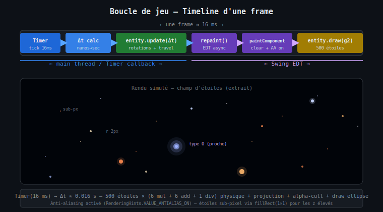
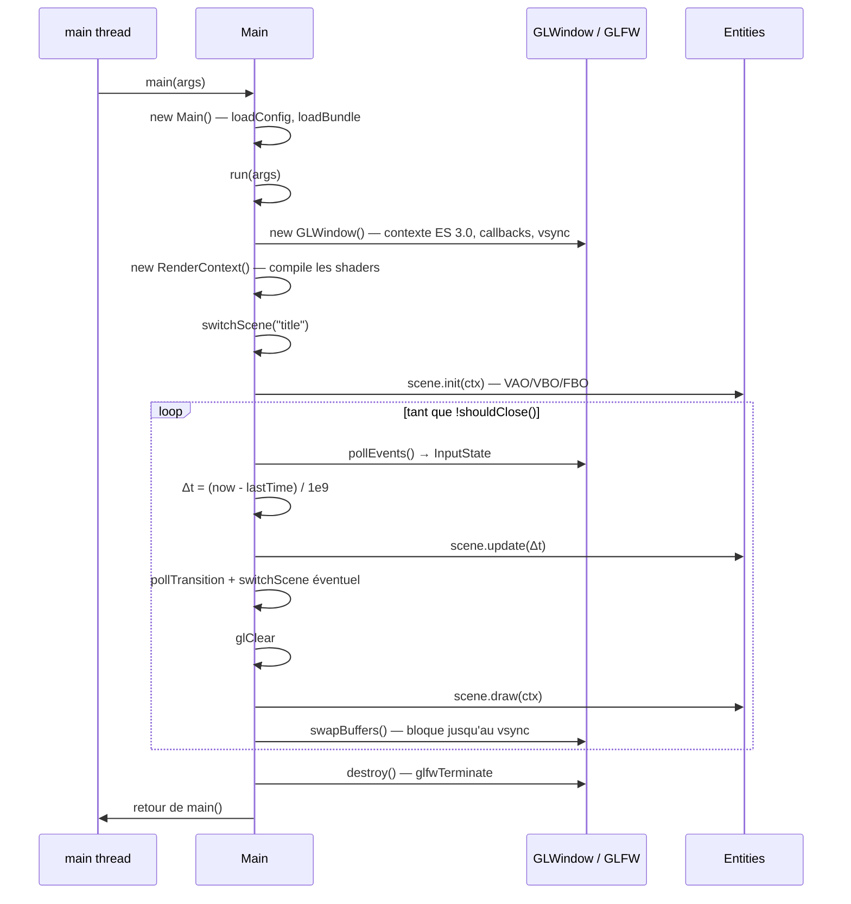
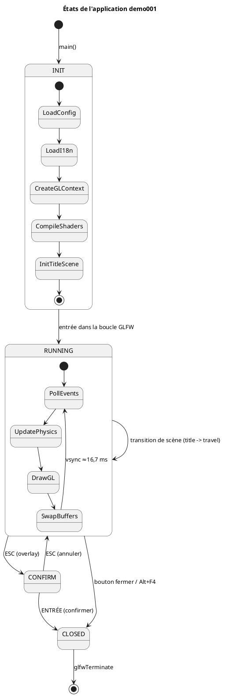

# Chapitre 7 — Boucle de jeu GLFW et delta-time

## Modèle de threading

Depuis la migration OpenGL (voir [chapitre 12](12-opengl-pipeline.md)), la boucle de
jeu est une **boucle classique sur le thread principal** : GLFW impose que la fenêtre
et le contexte GL soient manipulés sur le thread qui a appelé `glfwInit()`. Le
`main thread` ne se termine donc plus après l'initialisation — il *est* la boucle de
jeu, et la JVM vit tant que `runRenderLoop()` tourne. L'EDT Swing a disparu : AWT ne
sert plus qu'à rasteriser le texte, en mode headless, sans thread graphique.

Le cadencement n'est plus assuré par un `javax.swing.Timer` mais par la
**synchronisation verticale** : `glfwSwapInterval(1)` fait bloquer `swapBuffers()`
jusqu'au prochain rafraîchissement de l'écran (60 Hz), ce qui rythme naturellement
la boucle à ~16,7 ms par frame.



---

## Diagramme de séquence — démarrage et boucle



---

## Diagramme d'états de l'application



---

## Delta-time (Δt)

Le vsync cadence la boucle à ~16,7 ms, mais la durée réelle d'une frame varie
(charge système, frame ratée). Utiliser un **delta-time mesuré** plutôt qu'un pas
fixe garantit une simulation stable quelle que soit la cadence effective :

$$\Delta t = \frac{t_{\text{now}} - t_{\text{last}}}{10^9} \quad \text{(secondes)}$$

```xml
<math xmlns="http://www.w3.org/1998/Math/MathML">
  <mi>Δt</mi>
  <mo>=</mo>
  <mfrac>
    <mrow>
      <msub><mi>t</mi><mi>now</mi></msub>
      <mo>-</mo>
      <msub><mi>t</mi><mi>last</mi></msub>
    </mrow>
    <msup><mn>10</mn><mn>9</mn></msup>
  </mfrac>
  <mtext> (secondes)</mtext>
</math>
```

`System.nanoTime()` est utilisé (pas `currentTimeMillis`) car il est monotone et
n'est pas affecté par les corrections d'horloge système (NTP, etc.).

---

## Cadence cible et fréquence d'images

| Paramètre | Valeur | Commentaire |
|-----------|--------|-------------|
| Cadencement | vsync (`glfwSwapInterval(1)`) | 60 Hz → ≈16,7 ms/frame |
| Étoiles simulées | 500 | update CPU O(N), rendu en un seul draw call |
| Opérations par étoile (update) | 6 mul + 6 add (rotations) + 1 division (travel) | Pas de matrice allouée |
| Budget rendu mesuré (llvmpipe) | 66-75 FPS | clear ~0,5 + nébuleuses ~3-5 + étoiles/HUD ~5,8 (voir ch. 12) |

### Afficheur de FPS

La fréquence réelle est mesurée et affichée en haut à gauche (position `(10, 40)`,
texte blanc, police 9 pt — `StarfieldBehavior.drawFpsHud()`). Plutôt qu'un
$1/\Delta t$ instantané (trop nerveux), les frames sont **accumulées sur une
fenêtre** de $T = 0.5$ s puis moyennées :

<math xmlns="http://www.w3.org/1998/Math/MathML" display="block">
  <mrow>
    <mtext>FPS</mtext>
    <mo>=</mo>
    <mo>round</mo>
    <mrow>
      <mo>(</mo>
      <mfrac>
        <msub><mi>n</mi><mtext>frames</mtext></msub>
        <mrow><mo>∑</mo><mi>Δt</mi></mrow>
      </mfrac>
      <mo>)</mo>
    </mrow>
  </mrow>
</math>

L'afficheur se rafraîchit donc deux fois par seconde avec une valeur stable, et le
coût de mesure est négligeable (un compteur et une addition par frame).

---

## Extrait de code — runRenderLoop

```java
GLWindow window = new GLWindow(windowWidth, windowHeight, windowTitle, inputState);
RenderContext ctx = new RenderContext(windowWidth, windowHeight);
for (Entity entity : entities) entity.init(ctx);

glDisable(GL_DEPTH_TEST);
glEnable(GL_BLEND);
glBlendFunc(GL_SRC_ALPHA, GL_ONE_MINUS_SRC_ALPHA);   // équivalent SrcOver Java2D
glClearColor(0f, 0f, 0f, 1f);

lastTime = System.nanoTime();
while (!window.shouldClose()) {
    window.pollEvents();

    long now = System.nanoTime();
    double dt = (now - lastTime) / 1_000_000_000.0;
    lastTime = now;

    for (Entity entity : entities) entity.update(dt);

    glClear(GL_COLOR_BUFFER_BIT);
    for (Entity entity : entities) entity.draw(ctx);
    if (window.isConfirmQuit()) drawExitOverlay(ctx);

    window.swapBuffers();
}
window.destroy();
```

Il n'y a pas de test de profondeur (`GL_DEPTH_TEST` désactivé) : la scène est
composée **de l'arrière vers l'avant** par blending alpha, exactement comme
l'ancien pipeline Java2D — l'ordre d'insertion des behaviors est l'ordre de
superposition.

---

## Leçon de performance

Sur cette machine, le rendu OpenGL passe par **llvmpipe** (rasteriseur logiciel
Mesa, pas de driver GPU) : chaque pixel blendé coûte ~12 ns. Le budget se gère
donc comme sur le CPU : limiter le nombre de pixels écrits (rectangle englobant
des nébuleuses, cache FBO — [chapitre 11](11-nebula-field.md)) et le nombre de
passes plein écran. Les formules et techniques restent valables telles quelles
sur un vrai GPU, où ces coûts deviennent négligeables.

---

> Voir aussi :
> - [01 — Architecture générale](01-architecture.md)
> - [02 — Pattern Entity / Behavior](02-entity-behavior.md)
> - [05 — Rotations 3D](05-rotations-3d.md)
> - [12 — Pipeline OpenGL](12-opengl-pipeline.md)
