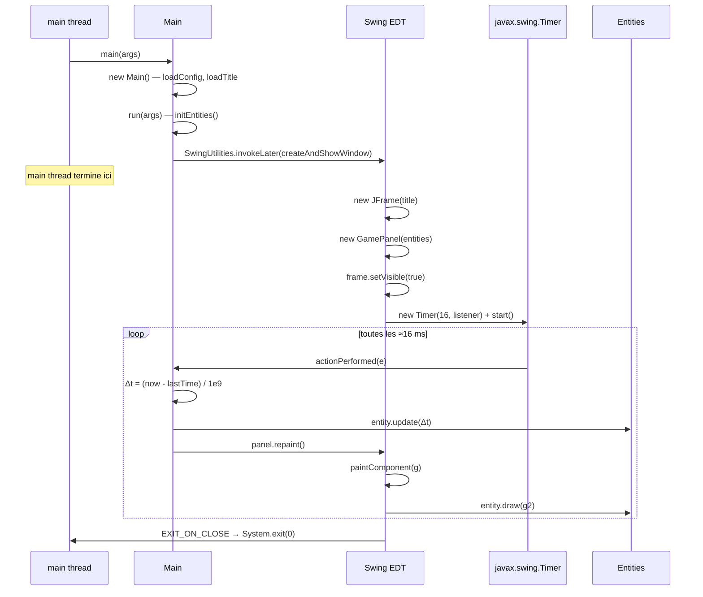
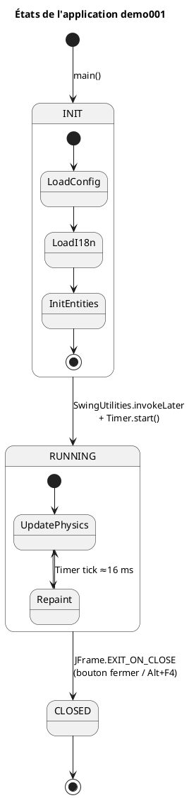

# Chapitre 7 — Boucle de jeu et intégration Swing

## Modèle de threading Swing

Java Swing impose un modèle **single-threaded** : tous les composants graphiques doivent
être créés et manipulés exclusivement sur l'**EDT** (Event Dispatch Thread). Ce thread
gère la peinture, les événements utilisateur (clavier, souris) et les repaints.

Le `main thread` lance l'application puis se termine — c'est l'EDT (non-daemon) qui
maintient la JVM en vie jusqu'à la fermeture de la fenêtre.


---

## Diagramme de séquence — démarrage et boucle



---

## Diagramme d'états de l'application



---

## Delta-time (Δt)

Le timer se déclenche toutes les 16 ms, mais la précision réelle dépend du scheduler
de l'OS. Utiliser un **delta-time mesuré** plutôt qu'un pas fixe garantit une
simulation stable quelle que soit la charge système :

$$\Delta t = \frac{t_{\text{now}} - t_{\text{last}}}{10^9} \quad \text{(secondes)}$$

```xml
<math xmlns="http://www.w3.org/1998/Math/MathML">
  <mi>Δt</mi>
  <mo>=</mo>
  <mfrac>
    <mrow>
      <msub><mi>t</mi><mi>now</mi></msub>
      <mo>-</mo>
      <msub><mi>t</mi><mi>last</mi></msub>
    </mrow>
    <msup><mn>10</mn><mn>9</mn></msup>
  </mfrac>
  <mtext> (secondes)</mtext>
</math>
```

`System.nanoTime()` est utilisé (pas `currentTimeMillis`) car il est monotone et
n'est pas affecté par les corrections d'horloge système (NTP, etc.).

---

## Cadence cible et fréquence d'images

| Paramètre | Valeur | Commentaire |
|-----------|--------|-------------|
| Délai Timer | 16 ms | ≈ 62,5 fps théorique |
| Fréquence effective | ~60 fps | Dépend du scheduler et du temps de rendu |
| Étoiles simulées | 500 | Coût O(N) par frame |
| Opérations par étoile | 6 mul + 6 add (rotations) + 1 division (travel) | Pas de matrice allouée |

---

## GamePanel — intégration Swing

`GamePanel` étend `JPanel` et surcharge `paintComponent` — la méthode standard
recommandée par Swing pour le dessin personnalisé :

```java
private static class GamePanel extends JPanel {
    private final List<Entity> entities;

    GamePanel(List<Entity> entities) {
        this.entities = entities;
        setBackground(Color.BLACK);
    }

    @Override
    protected void paintComponent(Graphics g) {
        super.paintComponent(g);   // efface le fond (Color.BLACK)
        Graphics2D g2 = (Graphics2D) g;
        g2.setRenderingHint(RenderingHints.KEY_ANTIALIASING,
                            RenderingHints.VALUE_ANTIALIAS_ON);
        for (Entity e : entities) e.draw(g2);
    }
}
```

L'anti-aliasing est activé via `RenderingHints` pour que les cercles des étoiles
soient lissés. L'appel à `super.paintComponent(g)` est **obligatoire** : il efface
le contenu de la frame précédente avant de dessiner la nouvelle.

---

## Anti-aliasing et performance

L'activation de `VALUE_ANTIALIAS_ON` améliore la qualité visuelle des ellipses mais
a un coût CPU. Pour 500 étoiles à 60 fps, ce coût est négligeable sur du matériel
moderne. Si les performances devenaient un enjeu, on pourrait désactiver l'AA pour les
étoiles sub-pixel (déjà gérées par `fillRect` au lieu d'`Ellipse2D`).

---

> Voir aussi :
> - [01 — Architecture générale](01-architecture.md)
> - [02 — Pattern Entity / Behavior](02-entity-behavior.md)
> - [05 — Rotations 3D](05-rotations-3d.md)
