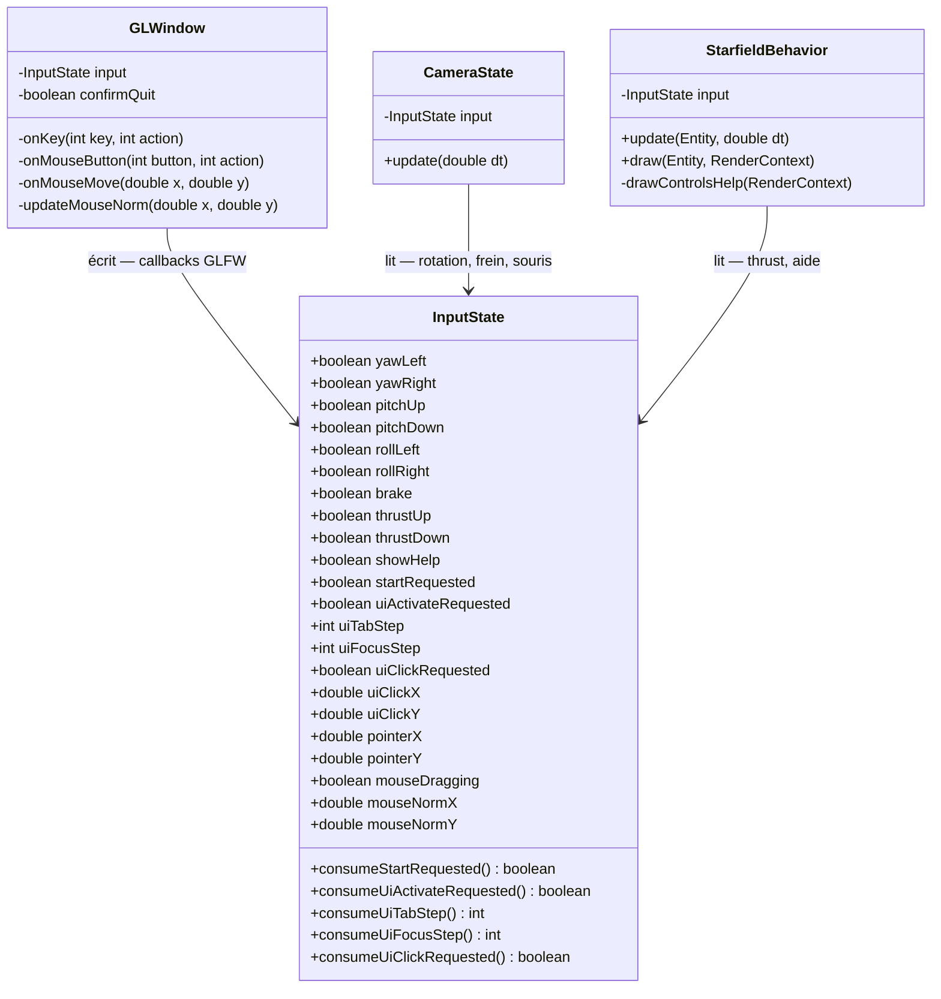
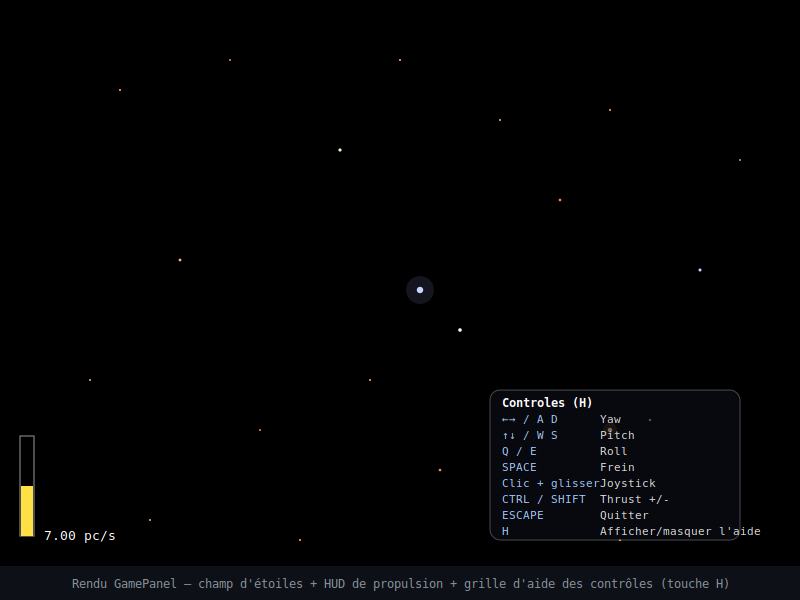

# Chapitre 8 — Contrôle interactif : clavier et souris

## Motivation

Par défaut, la caméra dérive librement selon un processus brownien (voir
[chapitre 5](05-rotations-3d.md)). Le chapitre 8 décrit comment l'utilisateur peut
reprendre la main et piloter la caméra comme un vaisseau spatial, en utilisant le
clavier et/ou la souris, sans rompre l'animation ambiante lorsqu'aucune entrée n'est
active.

---

## Vue d'ensemble des composants



`InputState` est un objet de valeur mutable partagé entre `GLWindow` (producteur —
les callbacks GLFW `glfwSetKeyCallback`, `glfwSetMouseButtonCallback`,
`glfwSetCursorPosCallback`) et deux consommateurs : `CameraState` (rotation
yaw/pitch/roll, frein, joystick souris — voir [chapitre 5](05-rotations-3d.md)) et
`StarfieldBehavior` (poussée moteur CTRL/SHIFT, affichage de l'aide). Les callbacks
GLFW sont invoqués par `glfwPollEvents()`, appelé **sur le thread de la boucle de
jeu elle-même** — il n'y a donc pas de condition de course, aucun `volatile` ni
verrou n'est nécessaire.

---

## Mapping des contrôles

| Action          | Clavier              | Souris                          |
|-----------------|---------------------|---------------------------------|
| Yaw gauche      | ← Arrow, A           | —                               |
| Yaw droite      | → Arrow, D           | —                               |
| Pitch haut      | ↑ Arrow, W           | —                               |
| Pitch bas       | ↓ Arrow, S           | —                               |
| Roll gauche     | Q                    | —                               |
| Roll droite     | E                    | —                               |
| Frein           | SPACE                | —                               |
| Joystick yaw+pitch | —               | Clic gauche maintenu + glisser  |
| Puissance moteur +| CTRL                 | —                               |
| Puissance moteur -| SHIFT                | —                               |
| Demarrer le voyage (ecran titre) | ENTER | —                               |
| Navigation boutons UI (ecran titre/menu) | TAB / SHIFT+TAB, FLECHES | —     |
| Activer bouton UI (ecran titre/menu) | ENTER | Clic gauche                 |
| Retour au titre (depuis TravelScene) | ESCAPE | —                           |
| Afficher/masquer l'aide | H              | —                               |

La puissance moteur (`thrustUp`/`thrustDown`) pilote la vitesse d'avancement du
vaisseau et alimente le HUD — voir [chapitre 9](09-thrust-engine.md).

---

## Grille d'aide des contrôles — H

`InputState.showHelp` est un booléen affiché à `true` par défaut : la grille d'aide
est donc **visible au démarrage**, sans action de l'utilisateur. Comme ESCAPE, H ne
pilote pas un état moteur continu mais une **bascule** (toggle) — appuyer une fois
inverse `showHelp`, peu importe la durée de l'appui.

La répétition de touche du système d'exploitation (key-repeat) pose un problème
classique pour un toggle : tant que H reste enfoncée, l'OS génère des événements
répétés, ce qui ferait clignoter l'affichage si chacun inversait `showHelp`. GLFW
résout cela nativement : les répétitions arrivent avec `action == GLFW_REPEAT`,
qu'il suffit d'ignorer — seul le `GLFW_PRESS` initial bascule l'état :

```java
private void onKey(int key, int action) {
    if (action == GLFW_REPEAT) return;
    boolean down = action == GLFW_PRESS;
    switch (key) {
        // ...
        case GLFW_KEY_H -> { if (down) input.showHelp = !input.showHelp; }
    }
}
```

Le rendu lui-même est délégué à `StarfieldBehavior.drawControlsHelp()`, appelé en
toute fin de `draw()` (après le HUD de propulsion) si `input.showHelp` est vrai : un
panneau semi-transparent arrondi (rectangle SDF du `quad` shader), ancré en bas à
droite, énumère l'intégralité du mapping clavier/souris ci-dessus.



---

## ESCAPE — retour de scene

La touche ESCAPE déclenche désormais un événement transient
`input.escapeRequested = true`. Dans `TravelScene`, cet événement est consommé pour
émettre une transition vers `TitleScene` (retour écran titre). Dans `TitleScene`,
l'événement est consommé et ignoré pour éviter un effet de bord lors d'une future
entrée dans la simulation.

La sortie de l'application se fait par le bouton `Quitter` de l'écran titre.

## Action transient "start" pour TitleScene

La touche ENTER (ou keypad ENTER) ne pilote pas un état continu : elle déclenche
`input.startRequested = true` sur `GLFW_PRESS`. `TitleScene` consomme ensuite cet
événement via `consumeStartRequested()` (read-and-reset) afin de produire au plus
une transition par appui.

Le même appui ENTER produit aussi `uiActivateRequested` (validation du bouton
focalisé). TAB remplit `uiTabStep` (`+1` ou `-1` avec SHIFT), les flèches
alimentent `uiFocusStep` (`-1` pour gauche/haut, `+1` pour droite/bas), et un
clic gauche alimente `uiClickRequested` avec ses coordonnées pixel
(`uiClickX`, `uiClickY`).

---

## Modèle de vitesse angulaire hybride

Trois modes s'appliquent dans `CameraState.update()`, par ordre de priorité :

### 1. Frein (SPACE)

Les vitesses angulaires décroissent exponentiellement vers zéro :

$$\omega_{n+1} = \omega_n \cdot \max\!\left(0,\; 1 - k_{\text{brake}} \cdot \Delta t\right)$$

avec $k_{\text{brake}} = 8\ \text{s}^{-1}$.

```xml
<math xmlns="http://www.w3.org/1998/Math/MathML">
  <msub><mi>ω</mi><mrow><mi>n</mi><mo>+</mo><mn>1</mn></mrow></msub>
  <mo>=</mo>
  <msub><mi>ω</mi><mi>n</mi></msub>
  <mo>·</mo>
  <mo>max</mo><mo>(</mo><mn>0</mn><mo>,</mo>
  <mn>1</mn><mo>-</mo><msub><mi>k</mi><mi>brake</mi></msub><mo>·</mo><mi>Δt</mi>
  <mo>)</mo>
</math>
```

### 2. Contrôle actif (touche ou souris)

Une vitesse cible $\omega^*$ est calculée depuis les entrées actives. La vitesse réelle
converge vers cette cible par interpolation linéaire (lerp) :

$$\omega_{n+1} = \omega_n + \left(\omega^* - \omega_n\right) \cdot k_{\text{lerp}} \cdot \Delta t$$

avec $k_{\text{lerp}} = 4\ \text{s}^{-1}$ (temps de réponse ~0,25 s).

La cible clavier est binaire : $\omega^* \in \{-\omega_{\max}, 0, +\omega_{\max}\}$.

La cible souris est analogique :

$$\omega^*_{\text{yaw}} = \hat{x}_{\text{mouse}} \cdot \omega_{\max}, \quad
  \omega^*_{\text{pitch}} = \hat{y}_{\text{mouse}} \cdot \omega_{\max}$$

où $\hat{x}, \hat{y} \in [-1, 1]$ sont les coordonnées normalisées relatives au centre
du panel, avec une zone morte de 0,08.

```xml
<math xmlns="http://www.w3.org/1998/Math/MathML">
  <msub><mi>ω</mi><mrow><mi>n</mi><mo>+</mo><mn>1</mn></mrow></msub>
  <mo>=</mo>
  <msub><mi>ω</mi><mi>n</mi></msub>
  <mo>+</mo>
  <mo>(</mo>
  <msup><mi>ω</mi><mo>*</mo></msup>
  <mo>-</mo>
  <msub><mi>ω</mi><mi>n</mi></msub>
  <mo>)</mo>
  <mo>·</mo>
  <msub><mi>k</mi><mi>lerp</mi></msub>
  <mo>·</mo>
  <mi>Δt</mi>
</math>
```

### 3. Dérive brownienne (aucune entrée)

Comportement autonome original — voir [chapitre 5](05-rotations-3d.md).

---

## Flowchart — logique de contrôle dans update()

```mermaid
flowchart TD
    A([update dt]) --> B{SPACE pressé ?}
    B -- oui --> C[Décroissance rapide\nω *= max(0, 1 − 8·dt)]
    B -- non --> D{Touche ou\nsouris active ?}
    D -- oui --> E[Calcul cible ω*\nclavier OU souris joystick]
    E --> F[Lerp : ω += (ω*-ω)·4·dt]
    D -- non --> G[Dérive brownienne\nω += N(0,σ²)·dt]
    G --> H[Clamp ±MAX_VEL]
    C --> I[Calcul angles frame\nα = ω × dt]
    F --> I
    H --> I
    I --> J[Rotations + forward travel\npour chaque étoile]
```

---

## Coordonnées normalisées de la souris

Le glisser de la souris est converti en coordonnées de joystick :

$$\hat{x} = \text{clamp}\!\left(\frac{x_{\text{mouse}} - c_x}{c_x},\; -1,\; 1\right)$$

avec $c_x = \text{width}/2$ (centre du panel). Idem pour $\hat{y}$.

Un seuil de zone morte $d = 0.08$ filtre les micro-mouvements involontaires :
si $|\hat{x}| < d$, la composante yaw est ignorée.

---

## Extrait de code — CameraState.update()

```java
boolean anyKey = input.yawLeft || input.yawRight || input.pitchUp
               || input.pitchDown || input.rollLeft || input.rollRight;
boolean mouseActive = input.mouseDragging
                    && (Math.abs(input.mouseNormX) > MOUSE_DEAD
                        || Math.abs(input.mouseNormY) > MOUSE_DEAD);

if (input.brake) {
    double decay = Math.max(0.0, 1.0 - BRAKE_DECAY * dt);
    velYaw *= decay; velPitch *= decay; velRoll *= decay;
} else if (anyKey || mouseActive) {
    double tYaw = 0, tPitch = 0, tRoll = 0;
    if (input.yawLeft)   tYaw   = -MAX_VEL;
    if (input.yawRight)  tYaw   = +MAX_VEL;
    // ... (pitch, roll similaires)
    if (mouseActive) {
        tYaw   = input.mouseNormX * MAX_VEL;
        tPitch = input.mouseNormY * MAX_VEL;
    }
    velYaw   += (tYaw   - velYaw)   * LERP_RATE * dt;
    velPitch += (tPitch - velPitch) * LERP_RATE * dt;
    velRoll  += (tRoll  - velRoll)  * LERP_RATE * dt;
} else {
    // Brownian drift (original)
    velYaw   += driftRng.nextGaussian() * DRIFT_ACC * dt;
    // ...
}
```

---

> Voir aussi :
> - [05 — Rotations 3D](05-rotations-3d.md)
> - [07 — Boucle de jeu](07-game-loop.md)
> - [09 — Propulsion : puissance moteur et HUD](09-thrust-engine.md)
> - [01 — Architecture générale](01-architecture.md)
