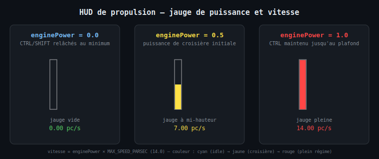
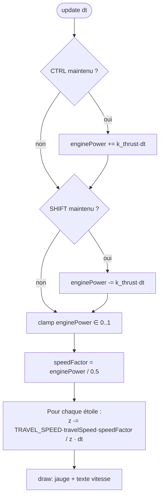
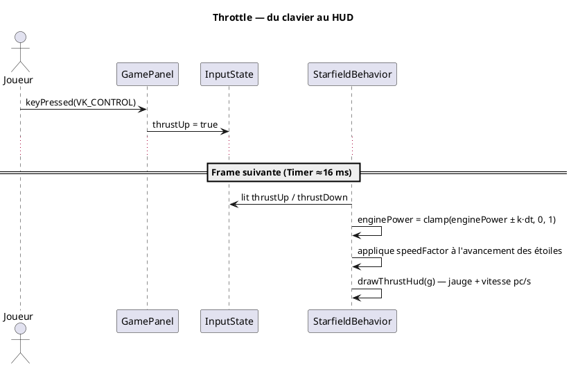

# Chapitre 9 — Propulsion : puissance moteur et HUD

## Motivation

Jusqu'ici, l'avancement du champ d'étoiles (voir [chapitre 5](05-rotations-3d.md))
se faisait à une vitesse constante (`TRAVEL_SPEED`). Pour renforcer la sensation de
pilotage d'un vaisseau spatial, le joueur contrôle désormais la **puissance des
moteurs** au clavier, et cette puissance pilote directement la vitesse d'avancement.
Un HUD (Head-Up Display) affiche en temps réel une jauge de puissance et une vitesse
exprimée en parsecs par seconde (unité fictive, mais dont l'évolution suit une
logique physique simple et cohérente).



---

## Modèle de puissance moteur (throttle)

La puissance moteur `enginePower` est un scalaire normalisé dans `[0, 1]`, stocké
dans `StarfieldBehavior` et mis à jour à chaque frame dans `update()`, **avant** le
traitement des rotations (axe de contrôle indépendant du yaw/pitch/roll) :

- **CTRL** maintenu → `enginePower` augmente.
- **SHIFT** maintenu → `enginePower` diminue.
- Aucune des deux → la puissance reste inchangée (pas de décroissance automatique :
  contrairement aux vitesses angulaires, il n'y a pas de "dérive" de la puissance
  moteur).

$$P_{n+1} = \text{clamp}\!\left(P_n + (\mathbb{1}_{\text{CTRL}} - \mathbb{1}_{\text{SHIFT}}) \cdot k_{\text{thrust}} \cdot \Delta t,\; 0,\; 1\right)$$

avec $k_{\text{thrust}} = 0.45\ \text{s}^{-1}$ (`THRUST_RATE`) — environ 2,2 s pour
aller de 0 à pleine puissance.

```xml
<math xmlns="http://www.w3.org/1998/Math/MathML">
  <msub><mi>P</mi><mrow><mi>n</mi><mo>+</mo><mn>1</mn></mrow></msub>
  <mo>=</mo>
  <mo>clamp</mo>
  <mo>(</mo>
  <msub><mi>P</mi><mi>n</mi></msub>
  <mo>+</mo>
  <mo>(</mo>
  <msub><mi>𝟙</mi><mi>CTRL</mi></msub>
  <mo>-</mo>
  <msub><mi>𝟙</mi><mi>SHIFT</mi></msub>
  <mo>)</mo>
  <mo>·</mo>
  <msub><mi>k</mi><mi>thrust</mi></msub>
  <mo>·</mo>
  <mi>Δt</mi>
  <mo>,</mo>
  <mn>0</mn>
  <mo>,</mo>
  <mn>1</mn>
  <mo>)</mo>
</math>
```

Si CTRL et SHIFT sont maintenus simultanément, les deux termes s'annulent — la
puissance reste stable, ce qui est le comportement attendu d'un "throttle" à deux
boutons opposés.

---

## Vitesse d'avancement liée à la puissance

La puissance moteur module directement le terme d'avancement par étoile (voir
[chapitre 5, §Avancement vers la caméra](05-rotations-3d.md)) :

$$z_{n+1} = z_n - \frac{v_{\text{base}} \cdot v_i}{z_n} \cdot \frac{P}{P_{\text{cruise}}} \cdot \Delta t$$

avec $P_{\text{cruise}} = 0.5$ (`INITIAL_THRUST`) — la puissance de croisière initiale,
choisie pour que le comportement par défaut (avant toute pression de touche)
corresponde exactement à l'ancienne vitesse fixe. Le facteur $P / P_{\text{cruise}}$
vaut donc :

| `enginePower` | Facteur de vitesse | Effet |
|---------------|---------------------|-------|
| 0.0 (moteurs coupés) | 0× | vaisseau immobile — aucun avancement |
| 0.5 (croisière, valeur initiale) | 1× | vitesse identique à l'ancien comportement fixe |
| 1.0 (pleine puissance) | 2× | vitesse double, warp plus marqué |

---

## Vitesse affichée (parsec/sec)

La vitesse affichée dans le HUD est une grandeur fictive, mais directement et
linéairement dérivée de `enginePower` — donc elle évolue toujours de façon cohérente
avec la sensation de vitesse réelle du champ d'étoiles :

$$v_{\text{affichée}} = P \cdot v_{\max} \quad \text{avec } v_{\max} = 14\ \text{pc/s (}\texttt{MAX\_SPEED\_PARSEC}\text{)}$$

À puissance de croisière (0.5), la vitesse affichée est donc 7,00 pc/s.

---

## HUD — jauge de puissance verticale

Dessinée par `StarfieldBehavior.drawThrustHud()`, appelée à la fin de `draw()`
(par-dessus le champ d'étoiles, donc toujours visible au premier plan) :

| Paramètre | Valeur | Rôle |
|-----------|--------|------|
| `GAUGE_X` | 20 px | distance depuis le bord gauche du panel |
| `GAUGE_WIDTH` | 14 px | largeur de la jauge |
| `GAUGE_HEIGHT` | 100 px | hauteur totale de la jauge |
| `GAUGE_MARGIN` | 64 px | distance entre le bas de la jauge et le bas du panel |

Le remplissage est calculé proportionnellement à `enginePower` et dessiné du bas
vers le haut, pour mimer une jauge de carburant/puissance classique :

```java
int fillHeight = (int) Math.round(GAUGE_HEIGHT * enginePower);
g.fillRect(GAUGE_X + 1, gaugeBottom - fillHeight, GAUGE_WIDTH - 1, fillHeight);
```

La couleur de remplissage interpole entre trois teintes selon la puissance
(`thrustColor()`) :

- **Cyan** (`#40C8FF`) en dessous de 50 % — régime faible.
- **Jaune** (`#FFE146`) à 50 % — régime de croisière.
- **Rouge** (`#FF4646`) à 100 % — pleine puissance.

La vitesse en pc/s est affichée en texte blanc, immédiatement à droite de la jauge,
alignée sur sa base.

---

## Flowchart — mise à jour du throttle



---

## Séquence — entrée clavier jusqu'au rendu HUD



---

> Voir aussi :
> - [05 — Rotations 3D](05-rotations-3d.md)
> - [08 — Contrôle interactif : clavier et souris](08-input-controls.md)
> - [07 — Boucle de jeu et intégration Swing](07-game-loop.md)
