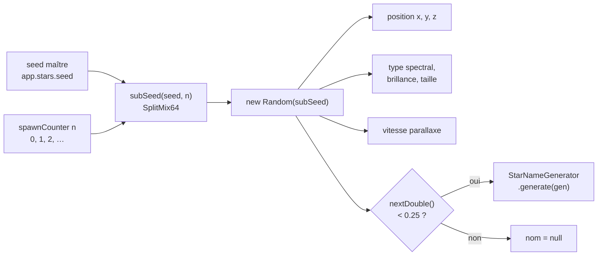
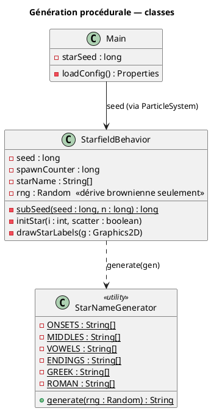
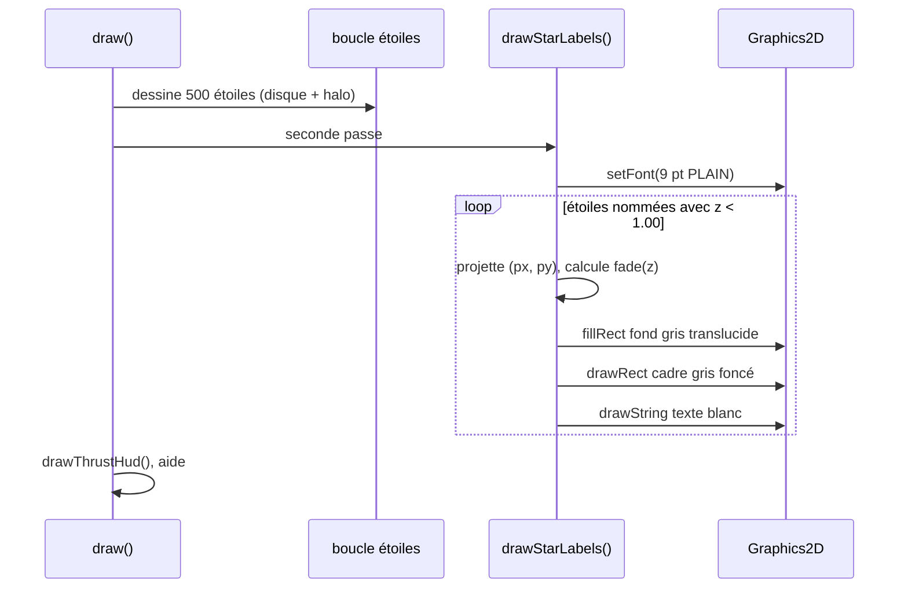

# Chapitre 10 — Génération procédurale : SEED et noms d'étoiles

## Rôle

Le champ d'étoiles n'est plus tiré d'un générateur aléatoire opaque : il est
**entièrement déterminé par un SEED maître** lu dans `config.properties`
(`app.stars.seed`, défaut `42`). Deux exécutions avec le même seed produisent
exactement le même univers — mêmes positions initiales, mêmes types spectraux,
mêmes noms — et chaque étoile réapparue (respawn) est elle aussi reproductible.

Deux mécanismes coopèrent :

1. **Sub-seeding par étoile** (`StarfieldBehavior.subSeed`) — chaque étoile générée
   reçoit son propre `Random` dérivé du seed maître et d'un compteur de spawn.
2. **Générateur de noms** (`StarNameGenerator`) — ~25 % des étoiles reçoivent un nom
   procédural, tiré du *même* flux aléatoire que leurs propriétés physiques.


---

## Sub-seeding : le finaliseur SplitMix64

Utiliser `new Random(seed + n)` serait fragile : les graines consécutives de
`java.util.Random` produisent des premières valeurs corrélées. On passe donc
l'indice de spawn à travers le **finaliseur SplitMix64**, une bijection sur les
64 bits qui décorrèle totalement deux entrées voisines :

$$
z_0 = s + n \cdot \phi_{64}, \qquad \phi_{64} = \mathtt{0x9E3779B97F4A7C15}
$$

<math xmlns="http://www.w3.org/1998/Math/MathML" display="block">
  <mrow>
    <msub><mi>z</mi><mn>1</mn></msub>
    <mo>=</mo>
    <mo>(</mo><msub><mi>z</mi><mn>0</mn></msub>
    <mo>⊕</mo>
    <mo>(</mo><msub><mi>z</mi><mn>0</mn></msub><mo>≫</mo><mn>30</mn><mo>)</mo>
    <mo>)</mo>
    <mo>·</mo>
    <mtext>0xBF58476D1CE4E5B9</mtext>
  </mrow>
</math>

<math xmlns="http://www.w3.org/1998/Math/MathML" display="block">
  <mrow>
    <msub><mi>z</mi><mn>2</mn></msub>
    <mo>=</mo>
    <mo>(</mo><msub><mi>z</mi><mn>1</mn></msub>
    <mo>⊕</mo>
    <mo>(</mo><msub><mi>z</mi><mn>1</mn></msub><mo>≫</mo><mn>27</mn><mo>)</mo>
    <mo>)</mo>
    <mo>·</mo>
    <mtext>0x94D049BB133111EB</mtext>
    <mo>,</mo>
    <mspace width="1em"/>
    <mtext>subSeed</mtext>
    <mo>=</mo>
    <msub><mi>z</mi><mn>2</mn></msub>
    <mo>⊕</mo>
    <mo>(</mo><msub><mi>z</mi><mn>2</mn></msub><mo>≫</mo><mn>31</mn><mo>)</mo>
  </mrow>
</math>

où ⊕ est le XOR bit-à-bit et ≫ le décalage logique à droite. La constante
$\phi_{64} = \lfloor 2^{64} / \varphi \rfloor$ (nombre d'or) garantit une
distribution équidistribuée des incréments.

`spawnCounter` est un `long` qui compte **toutes** les étoiles générées depuis le
démarrage : les 500 étoiles initiales occupent les indices 0–499, puis chaque
respawn consomme l'indice suivant. La n-ième étoile générée est donc identique
d'une exécution à l'autre.

> Le `Random` de champ (`rng`) subsiste, semé avec le seed maître, mais ne sert
> plus qu'au **bruit brownien** de la dérive caméra (chapitre 5) — sa consommation
> dépend du nombre de frames, il ne doit donc jamais alimenter la génération.



---

## StarNameGenerator

Les noms sont assemblés par **concaténation de syllabes** tirées de tables fixes :
une attaque (`ONSETS`), 0 à 2 syllabes internes (consonne + voyelle), une finale
(`ENDINGS`). Une désignation de catalogue est ajoutée dans 35 % des cas : préfixe
grec (`Alpha`, `Beta`, …, 15 %) ou numéro romain suffixé (`IV`, `VII`, …, 20 %).

Exemples produits : `Kravon`, `Alpha Kethris`, `Velthar IV`, `Nyllia`.

L'espace de noms est vaste : avec 30 attaques, 20 clusters, 10 voyelles et
20 finales, le seul squelette offre

$$
30 \times 20 \times (1 + 200 + 200^2) = 24\,120\,600 \text{ combinaisons.}
$$



Le point crucial : `generate(Random)` **consomme le flux du sub-seed de l'étoile**,
jamais un générateur partagé. Le nom fait partie de l'identité procédurale de
l'étoile au même titre que sa couleur.

---

## Étiquettes de nom à l'approche

Les étoiles nommées affichent une étiquette lorsque leur profondeur passe sous
`NAME_Z_THRESHOLD = 1.00`. L'opacité suit un **fondu linéaire** entre le seuil
d'apparition et `NAME_FULL_Z = 0.50`, profondeur à partir de laquelle l'étiquette
est pleinement opaque — le nom est ainsi lisible bien avant que l'étoile ne frôle
la caméra :

<math xmlns="http://www.w3.org/1998/Math/MathML" display="block">
  <mrow>
    <mi>fade</mi><mo>(</mo><mi>z</mi><mo>)</mo>
    <mo>=</mo>
    <mo>clamp</mo>
    <mrow>
      <mo>(</mo>
      <mfrac>
        <mrow><msub><mi>z</mi><mtext>seuil</mtext></msub><mo>−</mo><mi>z</mi></mrow>
        <mrow><msub><mi>z</mi><mtext>seuil</mtext></msub><mo>−</mo><msub><mi>z</mi><mtext>full</mtext></msub></mrow>
      </mfrac>
      <mo>,</mo><mn>0</mn><mo>,</mo><mn>1</mn>
      <mo>)</mo>
    </mrow>
  </mrow>
</math>

Pour laisser le temps de lire ces étiquettes, la puissance moteur initiale est
volontairement basse (`INITIAL_THRUST = 0.15`, soit 30 % de la vitesse de
croisière — voir [chapitre 9](09-thrust-engine.md)).

Style de l'étiquette (spécification) :

| Élément | Valeur |
|---------|--------|
| Police  | 9 pt, `Font.PLAIN` |
| Texte   | blanc, alpha = `fade × 255` |
| Cadre   | gris foncé `(85, 90, 100)`, alpha = `fade × 210` |
| Fond    | gris foncé translucide `(38, 42, 48)`, alpha = `fade × 150` |
| Position| à droite de l'étoile : `px + rayon + 8`, centrée verticalement |
| Marges  | 4 px horizontal, 2 px vertical |

Le rendu se fait dans `drawStarLabels`, une **seconde passe** exécutée après le
dessin de toutes les étoiles : les étiquettes flottent ainsi au-dessus du champ,
et la police n'est configurée qu'une seule fois.



---

## Configuration

```properties
# config.properties
app.stars.seed=42
```

Changer le seed régénère un univers entièrement différent mais tout aussi
reproductible. `Main` lit la propriété dans son constructeur et la propage :
`Main` → `ParticleSystem` → `StarfieldBehavior`.

---

> Voir aussi :
> - [03 — ParticleSystem](03-particle-system.md)
> - [04 — Classification spectrale](04-spectral-classification.md)
> - [06 — Projection perspective](06-perspective-projection.md)
