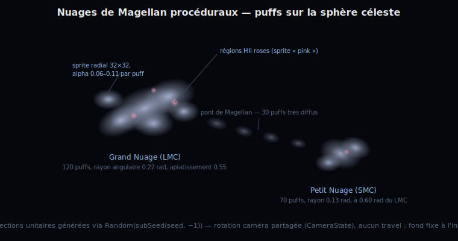
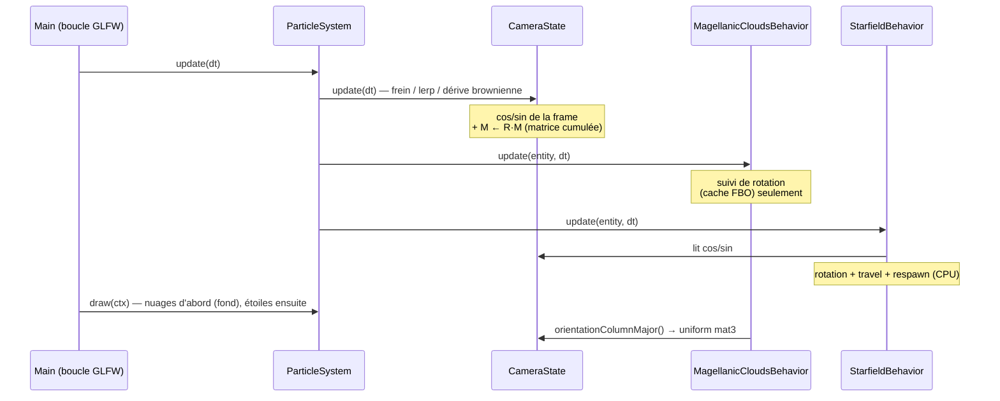
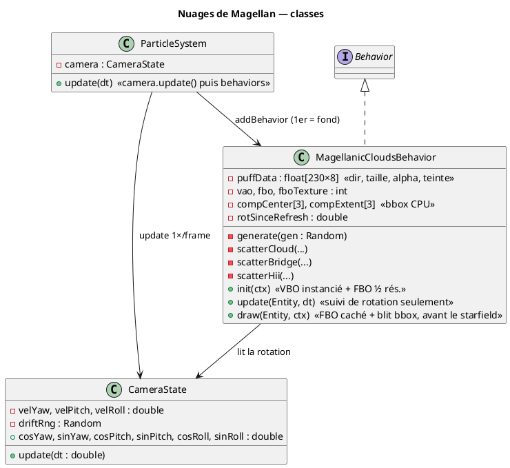
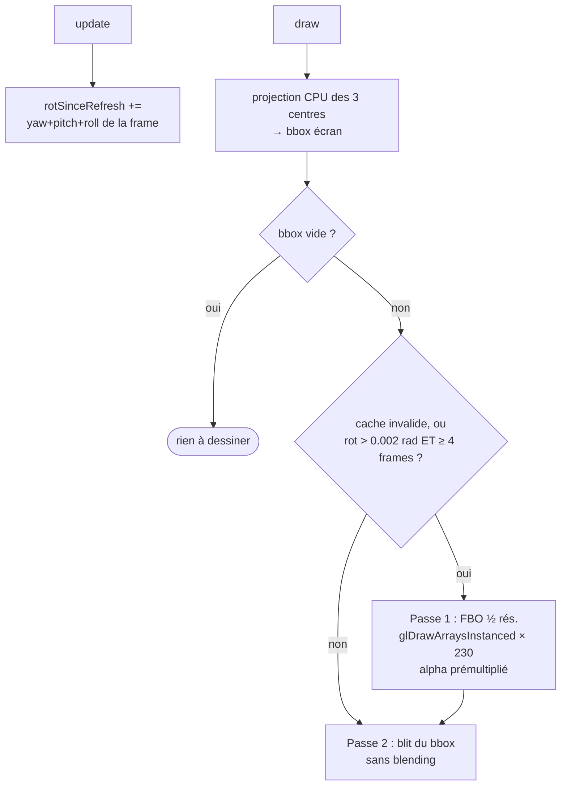

# Chapitre 11 — Nuages de Magellan et caméra partagée

## Rôle

`MagellanicCloudsBehavior` ajoute une **couche d'arrière-plan** au champ d'étoiles :
deux galaxies naines irrégulières inspirées du Grand et du Petit Nuage de Magellan,
reliées par un pont diffus et parsemées de régions HII rosées (à la manière de la
nébuleuse de la Tarentule). Comme les vrais Nuages de Magellan, elles sont si
lointaines qu'elles forment un **fond fixe** : elles tournent avec la caméra mais ne
participent pas à l'avancement (travel) — elles ne grossissent jamais et ne
réapparaissent jamais.

L'introduction de cette seconde couche a motivé un refactoring : l'état de rotation
caméra, jusqu'ici enfoui dans `StarfieldBehavior`, est extrait dans **`CameraState`**,
partagé par toutes les couches.

---

## CameraState — une rotation, plusieurs couches

`ParticleSystem.update()` intègre la caméra **exactement une fois par frame**, avant
la mise à jour des `Behavior`. Le résultat est exposé sous deux formes : des
paires cos/sin précalculées (consommées par la rotation CPU des étoiles) et la
**matrice d'orientation cumulée** M (uniform mat3 du shader des nuages) :

Sans cet état partagé, chaque couche intégrerait sa propre vitesse angulaire et les
nuages « glisseraient » par rapport aux étoiles. La logique des trois modes (frein,
contrôle utilisateur, dérive brownienne) est inchangée — simplement déplacée
(voir [chapitre 5](05-rotations-3d.md) et [chapitre 8](08-input-controls.md)).

---

## Modèle : des « puffs » sur la sphère céleste

Chaque nuage est un ensemble de **puffs** — des vecteurs directions unitaires
$\mathbf{v}_i$ sur la sphère céleste, porteurs d'une taille angulaire, d'une
translucidité et d'une teinte. Un puff est projeté comme les étoiles
(chapitre 6), mais sa profondeur est la composante $z$ du vecteur unitaire :

<math xmlns="http://www.w3.org/1998/Math/MathML" display="block">
  <mrow>
    <msub><mi>p</mi><mi>x</mi></msub>
    <mo>=</mo>
    <msub><mi>c</mi><mi>x</mi></msub>
    <mo>+</mo>
    <mfrac><msub><mi>v</mi><mi>x</mi></msub><msub><mi>v</mi><mi>z</mi></msub></mfrac>
    <mo>·</mo>
    <msub><mi>s</mi><mi>x</mi></msub>
    <mo>,</mo>
    <mspace width="1em"/>
    <mi>r</mi>
    <mo>=</mo>
    <mfrac><mi>θ</mi><msub><mi>v</mi><mi>z</mi></msub></mfrac>
    <mo>·</mo>
    <msub><mi>s</mi><mi>x</mi></msub>
  </mrow>
</math>

où $θ$ est la taille angulaire du puff et $s_x$ le facteur d'échelle de projection.
Les puffs avec $v_z < 0.15$ (proches du plan de vue ou derrière) sont éliminés.

### Dispersion anisotrope

Les puffs d'un nuage sont dispersés autour du centre $\mathbf{c}$ par un tirage
**gaussien anisotrope** dans le plan tangent $(\mathbf{u}, \mathbf{v})$ :

$$
\mathbf{p} = \operatorname{normalize}\!\left(\mathbf{c} + a\,\mathbf{u} + b\,\mathbf{v}\right),
\qquad a \sim \mathcal{N}(0, \sigma^2),\quad b \sim \mathcal{N}(0, (f\sigma)^2)
$$

avec $\sigma$ le rayon angulaire du nuage et $f < 1$ le facteur d'aplatissement
(0.55 pour le LMC — nettement elliptique, 0.70 pour le SMC). L'axe d'élongation est
tourné d'un angle aléatoire dans le plan tangent. Un tiers des puffs se resserre
autour de 2 à 4 **sous-grumeaux** ($\sigma' = 0.3\,\sigma$), donnant la structure
irrégulière et grumeleuse caractéristique des galaxies naines.

### Composition

| Composant | Puffs | Taille ang. | Alpha | Teinte |
|-----------|-------|-------------|-------|--------|
| Grand Nuage (LMC) | 120 | 0.06–0.15 rad | 0.06–0.11 | blanc bleuté (75 %) / blanc chaud |
| Petit Nuage (SMC) | 70 | 0.045–0.11 rad | 0.055–0.10 | blanc bleuté / blanc chaud |
| Pont de Magellan | 30 | 0.05–0.09 rad | 0.03–0.06 | blanc bleuté |
| Régions HII | 10 | 0.02–0.04 rad | 0.16–0.30 | rose (255, 170, 195) |

Le centre du LMC est tiré dans l'hémisphère avant ($v_z \in [0.55, 0.9]$) pour être
visible au démarrage ; le SMC est placé à 0.60 rad du LMC, azimut aléatoire ; le pont
suit l'arc de grand cercle entre les deux centres avec un jitter gaussien.

---

## Génération et déterminisme

Toute la génération consomme un unique `Random` semé par
`StarfieldBehavior.subSeed(seed, -1)` — l'indice **négatif** garantit l'absence de
collision avec les sub-seeds des étoiles (`spawnCounter` ≥ 0, voir
[chapitre 10](10-procedural-generation.md)). Même seed ⇒ mêmes nuages, aux mêmes
positions du ciel.

---

## Rendu GL : quads instanciés, FBO demi-résolution, bbox

L'aspect nuageux naît de l'**accumulation** : chaque puff est presque invisible
(α ≈ 0.06–0.11), mais leurs recouvrements construisent des densités variables —
cœur lumineux, bords évanescents. Ce surdessin (10-20× dans le cœur d'un nuage)
est aussi le principal coût sous le rasteriseur logiciel llvmpipe (~12 ns par
pixel blendé — voir [chapitre 12](12-opengl-pipeline.md)). Trois techniques le
ramènent à **~4 ms au pire cas** :

### 1. Quads instanciés + matrice d'orientation

Les 230 puffs (direction unitaire, taille angulaire, alpha, teinte) vivent dans
un **VBO statique** dessiné par `glDrawArraysInstanced` — un quad de 4 sommets
par puff, le dégradé radial étant évalué dans `cloud.frag`. Les points sprites
étaient exclus : un puff projeté peut dépasser la taille maximale de point.
La rotation caméra arrive par l'uniform **mat3 cumulée** de `CameraState`
(`M ← R_{roll}·R_{pitch}·R_{yaw}·M` chaque frame, ré-orthonormalisée
périodiquement) : la couche ne coûte **aucun travail CPU** par frame.

### 2. FBO demi-résolution + cache temporel

Les puffs s'accumulent dans un **framebuffer object** au quart des pixels
(`FBO_SCALE = 2`, invisible sur des dégradés aussi doux), en **alpha
prémultiplié** (`glBlendFunc(GL_ONE, GL_ONE_MINUS_SRC_ALPHA)`) — `cloud.frag`
sort `vec4(tint·a, a)`. Cette passe n'est **rejouée** que si la rotation cumulée
depuis le dernier rendu dépasse `REFRESH_ROT_EPS = 0.002` rad (≈ 0,7 px) et
qu'au moins `REFRESH_MIN_FRAMES = 4` frames se sont écoulées : en dérive lente
elle est rare, en rotation rapide son coût est amorti par 4 (retard borné
≤ ~4 px sur un voile diffus, imperceptible).

### 3. Composition restreinte au rectangle englobant

Chaque frame, le CPU projette les **centres des 3 composants** (LMC, SMC, pont —
via `CameraState.applyOrientation`) et leur étendue angulaire, calcule le
rectangle englobant à l'écran, et le shader `blit` ne compose que cette zone.
Nuages entièrement derrière la caméra → **aucune passe du tout**. Le blit se
fait **sans blending** : le calque est la première chose dessinée après le
`glClear`, et du prémultiplié sur fond noir égale la valeur source — une simple
écriture, bien moins chère qu'une lecture-modification-écriture.

> Leçon conservée de la version Java2D : que le rendu soit logiciel côté Java ou
> côté Mesa, le surdessin de fragments translucides domine — on le paie une fois
> (cache), sur moins de pixels (demi-résolution), et seulement là où il y a du
> contenu (bbox).

---

> Voir aussi :
> - [03 — ParticleSystem](03-particle-system.md) — ordre des couches
> - [05 — Rotations 3D](05-rotations-3d.md) — CameraState et dérive brownienne
> - [06 — Projection perspective](06-perspective-projection.md)
> - [10 — Génération procédurale](10-procedural-generation.md) — sub-seeding
