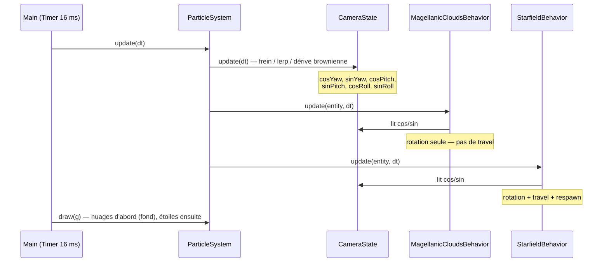
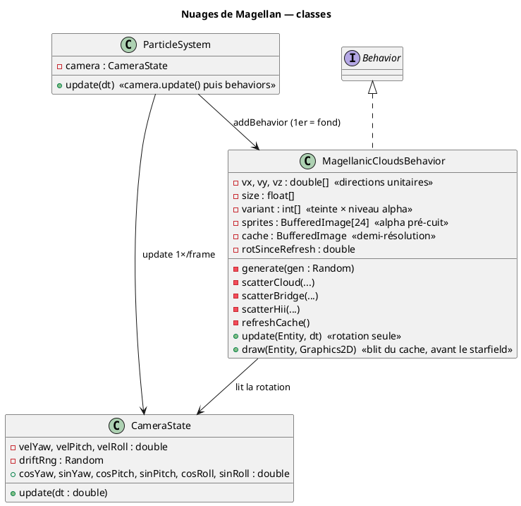
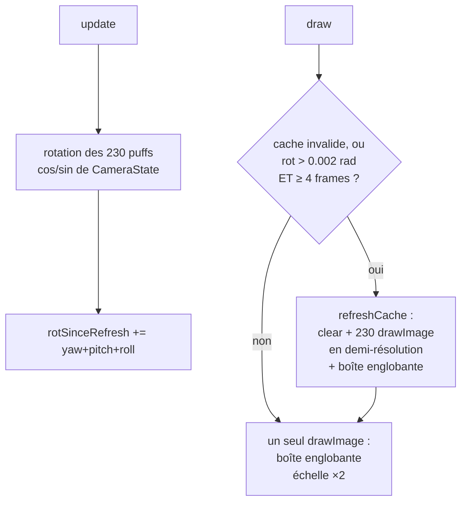

# Chapitre 11 — Nuages de Magellan et caméra partagée

## Rôle

`MagellanicCloudsBehavior` ajoute une **couche d'arrière-plan** au champ d'étoiles :
deux galaxies naines irrégulières inspirées du Grand et du Petit Nuage de Magellan,
reliées par un pont diffus et parsemées de régions HII rosées (à la manière de la
nébuleuse de la Tarentule). Comme les vrais Nuages de Magellan, elles sont si
lointaines qu'elles forment un **fond fixe** : elles tournent avec la caméra mais ne
participent pas à l'avancement (travel) — elles ne grossissent jamais et ne
réapparaissent jamais.

L'introduction de cette seconde couche a motivé un refactoring : l'état de rotation
caméra, jusqu'ici enfoui dans `StarfieldBehavior`, est extrait dans **`CameraState`**,
partagé par toutes les couches.

---

## CameraState — une rotation, plusieurs couches

`ParticleSystem.update()` intègre la caméra **exactement une fois par frame**, avant
la mise à jour des `Behavior`. Le résultat est exposé sous forme de paires
cos/sin précalculées que chaque couche consomme :

Sans cet état partagé, chaque couche intégrerait sa propre vitesse angulaire et les
nuages « glisseraient » par rapport aux étoiles. La logique des trois modes (frein,
contrôle utilisateur, dérive brownienne) est inchangée — simplement déplacée
(voir [chapitre 5](05-rotations-3d.md) et [chapitre 8](08-input-controls.md)).

---

## Modèle : des « puffs » sur la sphère céleste

Chaque nuage est un ensemble de **puffs** — des vecteurs directions unitaires
$\mathbf{v}_i$ sur la sphère céleste, porteurs d'une taille angulaire, d'une
translucidité et d'une teinte. Un puff est projeté comme les étoiles
(chapitre 6), mais sa profondeur est la composante $z$ du vecteur unitaire :

<math xmlns="http://www.w3.org/1998/Math/MathML" display="block">
  <mrow>
    <msub><mi>p</mi><mi>x</mi></msub>
    <mo>=</mo>
    <msub><mi>c</mi><mi>x</mi></msub>
    <mo>+</mo>
    <mfrac><msub><mi>v</mi><mi>x</mi></msub><msub><mi>v</mi><mi>z</mi></msub></mfrac>
    <mo>·</mo>
    <msub><mi>s</mi><mi>x</mi></msub>
    <mo>,</mo>
    <mspace width="1em"/>
    <mi>r</mi>
    <mo>=</mo>
    <mfrac><mi>θ</mi><msub><mi>v</mi><mi>z</mi></msub></mfrac>
    <mo>·</mo>
    <msub><mi>s</mi><mi>x</mi></msub>
  </mrow>
</math>

où $θ$ est la taille angulaire du puff et $s_x$ le facteur d'échelle de projection.
Les puffs avec $v_z < 0.15$ (proches du plan de vue ou derrière) sont éliminés.

### Dispersion anisotrope

Les puffs d'un nuage sont dispersés autour du centre $\mathbf{c}$ par un tirage
**gaussien anisotrope** dans le plan tangent $(\mathbf{u}, \mathbf{v})$ :

$$
\mathbf{p} = \operatorname{normalize}\!\left(\mathbf{c} + a\,\mathbf{u} + b\,\mathbf{v}\right),
\qquad a \sim \mathcal{N}(0, \sigma^2),\quad b \sim \mathcal{N}(0, (f\sigma)^2)
$$

avec $\sigma$ le rayon angulaire du nuage et $f < 1$ le facteur d'aplatissement
(0.55 pour le LMC — nettement elliptique, 0.70 pour le SMC). L'axe d'élongation est
tourné d'un angle aléatoire dans le plan tangent. Un tiers des puffs se resserre
autour de 2 à 4 **sous-grumeaux** ($\sigma' = 0.3\,\sigma$), donnant la structure
irrégulière et grumeleuse caractéristique des galaxies naines.

### Composition

| Composant | Puffs | Taille ang. | Alpha | Teinte |
|-----------|-------|-------------|-------|--------|
| Grand Nuage (LMC) | 120 | 0.06–0.15 rad | 0.06–0.11 | blanc bleuté (75 %) / blanc chaud |
| Petit Nuage (SMC) | 70 | 0.045–0.11 rad | 0.055–0.10 | blanc bleuté / blanc chaud |
| Pont de Magellan | 30 | 0.05–0.09 rad | 0.03–0.06 | blanc bleuté |
| Régions HII | 10 | 0.02–0.04 rad | 0.16–0.30 | rose (255, 170, 195) |

Le centre du LMC est tiré dans l'hémisphère avant ($v_z \in [0.55, 0.9]$) pour être
visible au démarrage ; le SMC est placé à 0.60 rad du LMC, azimut aléatoire ; le pont
suit l'arc de grand cercle entre les deux centres avec un jitter gaussien.

---

## Génération et déterminisme

Toute la génération consomme un unique `Random` semé par
`StarfieldBehavior.subSeed(seed, -1)` — l'indice **négatif** garantit l'absence de
collision avec les sub-seeds des étoiles (`spawnCounter` ≥ 0, voir
[chapitre 10](10-procedural-generation.md)). Même seed ⇒ mêmes nuages, aux mêmes
positions du ciel.

---

## Rendu : alpha pré-cuit + cache écran demi-résolution

L'aspect nuageux naît de l'**accumulation** : chaque puff est presque invisible
(α ≈ 0.06–0.11), mais leurs recouvrements construisent des densités variables —
cœur lumineux, bords évanescents. Ce surdessin (10-20× dans le cœur d'un nuage)
est aussi le principal coût : recomposer les ~230 puffs chaque frame montait à
**~12 ms** quand le Grand Nuage occupait le quart de l'écran — incompatible avec
60 FPS. Deux optimisations mesurées le ramènent à **~2,7 ms au pire cas** :

### 1. Translucidité pré-cuite dans les sprites

Un `AlphaComposite.getInstance(SRC_OVER, α)` par puff force Java2D dans sa boucle
de composition générique (10-20× plus lente qu'un blit). L'alpha de chaque puff
est donc quantifié sur 8 niveaux et **cuit dans les pixels** du sprite à la
construction : 3 teintes × 8 niveaux = 24 sprites 32×32 (`TYPE_INT_ARGB_PRE`,
alpha prémultiplié → boucles de blit rapides). Le dessin d'un puff devient un
`drawImage` nu, sans état de composition.

### 2. Cache écran demi-résolution

Le surdessin n'est payé que lorsque la vue change réellement : les puffs sont
composés dans un buffer hors-écran au **quart des pixels** (largeur et hauteur
divisées par `CACHE_SCALE = 2` — invisible sur des dégradés aussi doux), et ce
buffer n'est **rafraîchi** que si la rotation cumulée depuis le dernier rendu
dépasse `REFRESH_ROT_EPS = 0.002` rad (≈ 0,7 px à l'écran) **et** qu'au moins
`REFRESH_MIN_FRAMES = 4` frames se sont écoulées. Toutes les autres frames se
réduisent à **un seul blit** mis à l'échelle ×2, limité au rectangle englobant
du contenu réellement dessiné.

- En dérive brownienne lente : rafraîchissements rares, coût ≈ celui du blit.
- En rotation rapide : rafraîchissement au plus 1 frame sur 4 — le fond accuse
  un retard borné ≤ ~4 px, imperceptible sur un voile diffus, et le coût du
  surdessin est amorti par 4.

> Tentative écartée : dessiner chaque nuage comme un **imposteur** unique
> (une grande image transformée par `AffineTransform`). Mesuré 3-12 ms : le blit
> transformé de Java2D passe par un chemin générique ~16 ns/pixel, et la boîte
> englobante d'un pont allongé est presque vide. Les benchmarks ont tranché.

---

> Voir aussi :
> - [03 — ParticleSystem](03-particle-system.md) — ordre des couches
> - [05 — Rotations 3D](05-rotations-3d.md) — CameraState et dérive brownienne
> - [06 — Projection perspective](06-perspective-projection.md)
> - [10 — Génération procédurale](10-procedural-generation.md) — sub-seeding
