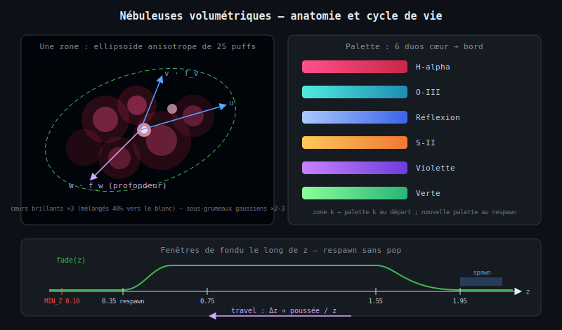
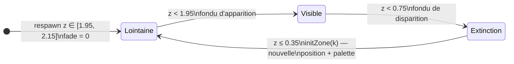
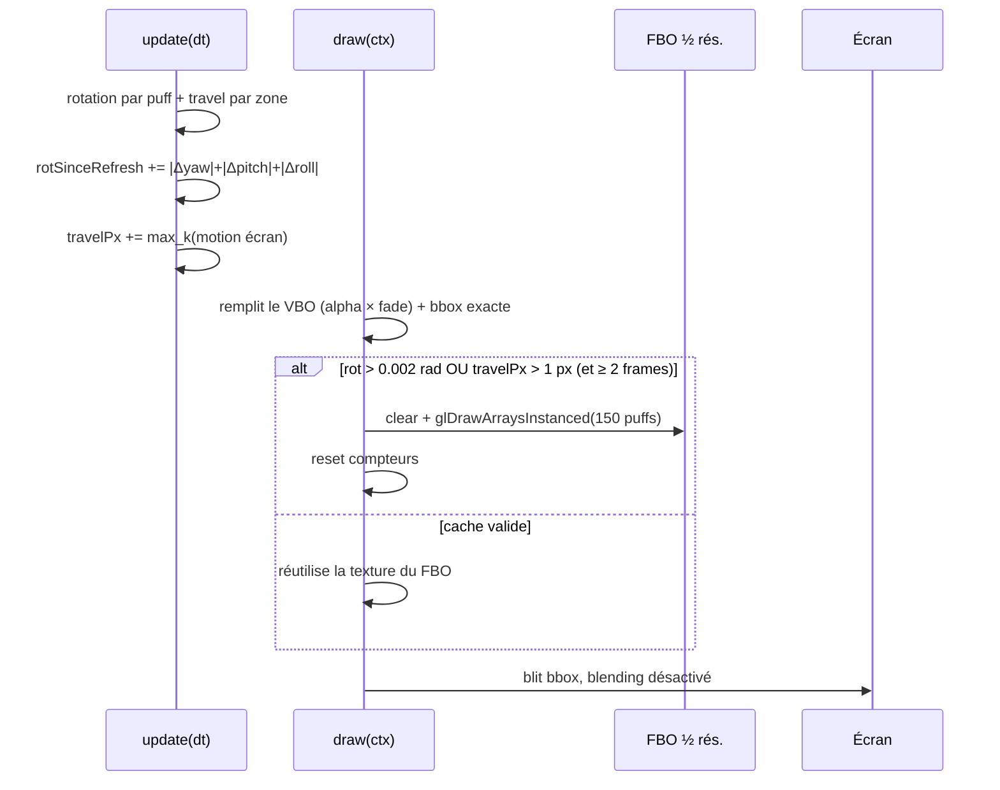
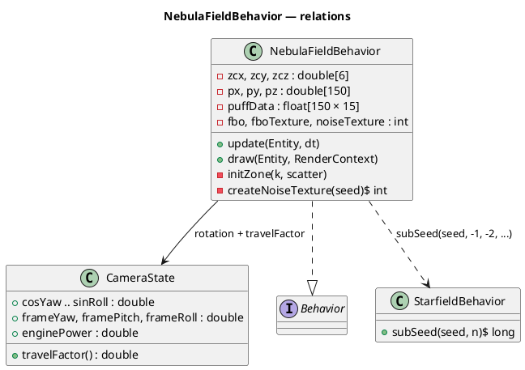

# Chapitre 11 — Nébuleuses volumétriques (NebulaFieldBehavior)

## Rôle

`NebulaFieldBehavior` peuple l'arrière-plan de **six zones gazeuses colorées** —
des nébuleuses — placées à des positions 3D finies **dans le même repère que les
étoiles**. Contrairement à l'ancien calque de nuages à l'infini, les nébuleuses
tournent avec la caméra **et avancent vers elle** sous l'effet de la poussée
moteur : le vaisseau les traverse, elles disparaissent en fondu à l'approche et
réapparaissent au loin sur une nouvelle position, avec une nouvelle couleur.

Chaque zone est un amas **ellipsoïdal anisotrope** de 25 « puffs » (bouffées de
gaz) : des quads doux dont le profil radial est modulé par une **texture de
bruit fBm** pré-calculée. Les puffs d'une même zone occupent des profondeurs
différentes — la composante de profondeur de leur dispersion crée une vraie
**parallaxe interne** au survol, d'où l'effet volumétrique.

---

## Génération procédurale

### Placement des zones

Chaque apparition de zone consomme un sous-seed dédié
(`subSeed(seed, -2 - zoneSpawnCounter++)`) — les indices négatifs n'entrent
jamais en collision avec ceux des étoiles (≥ 0) ni celui de la texture de
bruit (−1). Une zone est définie par :

| Paramètre | Plage | Rôle |
|---|---|---|
| centre `x, y` | `[-1.6, 1.6]` | position latérale |
| centre `z` (dispersion initiale) | `[0.5, 2.0]` | réparties dans la profondeur |
| centre `z` (respawn) | `[1.95, 2.15]` | coquille lointaine, derrière le fondu |
| rayon `R` | `[0.25, 0.50]` | taille de l'amas |
| `zoneSpeed` | `[0.6, 1.2]` | multiplicateur de vitesse (parallaxe) |
| palette | 1 parmi 6 | duo cœur → bord |

### Dispersion ellipsoïdale des puffs

L'amas est construit dans une **base orthonormée aléatoire** $(\mathbf{u},
\mathbf{v}, \mathbf{w})$ avec écrasement par axe ($f_v \in [0.35, 0.8]$,
$f_w \in [0.5, 1.0]$) — un ellipsoïde orienté arbitrairement, jamais une
sphère. Un tiers des puffs (1 sur 3) se concentre autour de 2–3 **sous-grumeaux**
gaussiens pour une structure irrégulière :

<math xmlns="http://www.w3.org/1998/Math/MathML" display="block">
  <mrow>
    <mover><mi>p</mi><mo>→</mo></mover>
    <mo>=</mo>
    <mover><mi>c</mi><mo>→</mo></mover>
    <mo>+</mo>
    <mi>a</mi><mo>·</mo><mover><mi>u</mi><mo>→</mo></mover>
    <mo>+</mo>
    <mi>b</mi><mo>·</mo><msub><mi>f</mi><mi>v</mi></msub><mo>·</mo><mover><mi>v</mi><mo>→</mo></mover>
    <mo>+</mo>
    <mi>c</mi><mo>·</mo><msub><mi>f</mi><mi>w</mi></msub><mo>·</mo><mover><mi>w</mi><mo>→</mo></mover>
    <mo>,</mo>
    <mspace width="1em"/>
    <mi>a</mi><mo>,</mo><mi>b</mi><mo>,</mo><mi>c</mi>
    <mo>∼</mo>
    <mi mathvariant="script">N</mi><mo>(</mo><mn>0</mn><mo>,</mo><msup><mi>R</mi><mn>2</mn></msup><mo>)</mo>
  </mrow>
</math>

La composante $\mathbf{w}$ (profondeur) est la clé du rendu volumétrique : les
puffs proches projettent plus grand et bougent plus vite que les puffs
lointains de la même zone.

### Palette — six duos de couleurs vives

| Type de nébuleuse | Cœur (RGB) | Bord (RGB) |
|---|---|---|
| H-alpha | magenta (255, 80, 140) | rouge profond (200, 40, 70) |
| O-III | cyan (80, 235, 220) | bleu sarcelle (30, 140, 180) |
| Réflexion | bleu pâle (170, 200, 255) | bleu profond (60, 100, 230) |
| S-II | or (255, 200, 90) | orange (240, 120, 50) |
| Violette | (200, 130, 255) | indigo (110, 60, 220) |
| Verte | (140, 255, 150) | émeraude (40, 180, 120) |

À la dispersion initiale, la zone $k$ reçoit la palette $k$ — les six types
sont visibles dès le démarrage. Au respawn, un tirage aléatoire évite la
palette précédente de la zone. Par puff, la couleur glisse du cœur vers le
bord selon la distance radiale normalisée (± jitter), avec une variation de
luminosité ×[0.85, 1.15]. Les 3 premiers puffs de chaque zone sont des
**cœurs brillants** (plus petits, plus opaques, mélangés à 40 % vers le
blanc) — l'équivalent des régions HII.

Toutes les couleurs sont **figées au spawn** dans les attributs d'instance :
le shader reste trivial.

---

## Texture de bruit fBm

Le caractère « gazeux » vient d'une texture RGBA 128×128 générée au `init()`
(seedée, reproductible) : **4 champs de value-noise indépendants** (un par
canal), chacun sommant 3 octaves tuilables (fréquences 8/16/32, amplitudes
1/½/¼) :

<math xmlns="http://www.w3.org/1998/Math/MathML" display="block">
  <mrow>
    <mi>n</mi><mo>(</mo><mi>x</mi><mo>,</mo><mi>y</mi><mo>)</mo>
    <mo>=</mo>
    <mfrac>
      <mrow>
        <munderover><mo>∑</mo><mrow><mi>o</mi><mo>=</mo><mn>0</mn></mrow><mn>2</mn></munderover>
        <msup><mn>2</mn><mrow><mo>−</mo><mi>o</mi></mrow></msup>
        <mo>·</mo>
        <msub><mi>V</mi><mi>o</mi></msub>
        <mo>(</mo><msup><mn>2</mn><mi>o</mi></msup><mi>x</mi><mo>,</mo>
        <msup><mn>2</mn><mi>o</mi></msup><mi>y</mi><mo>)</mo>
      </mrow>
      <mrow>
        <munderover><mo>∑</mo><mrow><mi>o</mi><mo>=</mo><mn>0</mn></mrow><mn>2</mn></munderover>
        <msup><mn>2</mn><mrow><mo>−</mo><mi>o</mi></mrow></msup>
      </mrow>
    </mfrac>
  </mrow>
</math>

Chaque puff reçoit un offset UV, une échelle UV et un **sélecteur de canal**
aléatoires — deux puffs ne montrent jamais le même motif. Le fragment shader
ne fait qu'**un seul fetch texture** (l'UV est calculée au vertex) : un fBm
procédural par fragment serait prohibitif sous rasteriseur logiciel.

---

## Mouvement : rotation, travel, respawn, fondu

### Rotation et travel

Les positions (puffs et centres) sont stockées **déjà tournées**, comme les
étoiles : `update()` applique la rotation incrémentale yaw→pitch→roll de
`CameraState` à chaque point, puis le **travel rigide par zone** — un seul
$\Delta z$ calculé sur le centre et soustrait à tout l'amas, qui garde ainsi
sa forme :

<math xmlns="http://www.w3.org/1998/Math/MathML" display="block">
  <mrow>
    <mi>Δz</mi>
    <mo>=</mo>
    <msub><mi>v</mi><mtext>travel</mtext></msub>
    <mo>·</mo>
    <msub><mi>s</mi><mi>k</mi></msub>
    <mo>·</mo>
    <mfrac>
      <mi>P</mi>
      <msub><mi>P</mi><mtext>cruise</mtext></msub>
    </mfrac>
    <mo>·</mo>
    <mfrac>
      <mi>Δt</mi>
      <msub><mi>z</mi><mi>c</mi></msub>
    </mfrac>
  </mrow>
</math>

avec $v_{\text{travel}} = 0.20$, $s_k$ le multiplicateur de la zone et
$P/P_{\text{cruise}}$ le facteur de poussée partagé (`camera.travelFactor()`,
voir [chapitre 9](09-thrust-engine.md)).

### Fondu near/far et respawn sans pop

L'opacité de la zone dépend uniquement de la profondeur de son centre :

$$\text{fade}(z) = \operatorname{smoothstep}(0.35,\ 0.75,\ z)\ \cdot\ \bigl(1 - \operatorname{smoothstep}(1.55,\ 1.95,\ z)\bigr)$$

- **Près** : la zone s'éteint entre $z = 0.75$ et $z = 0.35$ ; au respawn
  ($z \le 0.35$) elle est déjà invisible — aucun pop, et les puffs les plus
  grands (les plus chers en fill-rate) ne sont jamais dessinés pleine force.
- **Loin** : elle réapparaît en fondu entre $z = 1.95$ et $z = 1.55$ ; la
  coquille de respawn ($z \ge 1.95$) est entièrement dans la partie invisible.

---

## Rendu GL

### Attributs d'instance (15 floats / puff, VBO dynamique)

| Offset | Attribut | Contenu |
|---|---|---|
| 0 | `aPos` (vec3) | position vue tournée (x, y, z) |
| 12 | `aSize` (float) | rayon monde |
| 16 | `aAlpha` (float) | `baseAlpha × fade(z)` — le fondu est appliqué CPU |
| 20 | `aColIn` (vec3) | couleur du cœur |
| 32 | `aColOut` (vec3) | couleur du bord |
| 44 | `aNoise` (vec4) | offset UV, échelle UV, canal |

`nebula.vert` projette (`centre = pos.xy/z · projScale`, rayon plafonné à
`MAX_RADIUS = 128 px`), rejette les puffs derrière le plan ($z <$ `MIN_Z`)
ou éteints ($\alpha \le 0.001$) via un sommet dégénéré hors écran, et
prépare l'UV du bruit. `nebula.frag` combine profil radial et bruit :

<math xmlns="http://www.w3.org/1998/Math/MathML" display="block">
  <mrow>
    <mi>a</mi>
    <mo>=</mo>
    <msub><mi>α</mi><mtext>puff</mtext></msub>
    <mo>·</mo>
    <msup>
      <mrow>
        <mo>[</mo>
        <mo>(</mo><mn>1</mn><mo>−</mo><msup><mi>d</mi><mn>2</mn></msup><mo>)</mo>
        <mo>·</mo>
        <mo>(</mo><mn>0.35</mn><mo>+</mo><mn>0.75</mn><mo>·</mo><mi>n</mi><mo>)</mo>
        <mo>]</mo>
      </mrow>
      <mn>2</mn>
    </msup>
  </mrow>
</math>

où $d$ est la distance radiale normalisée et $n$ le bruit échantillonné. La
mise au carré garde les bords vaporeux ; la teinte interpole cœur → bord en
$d^2$. La sortie est en **alpha prémultiplié** — le contrat du FBO et du blit
est inchangé.

### Cache FBO hybride : rotation OU travel

Le calque s'accumule dans un **FBO demi-résolution** (4× moins de fragments)
et se composite en un seul quad **sans blending**, restreint au rectangle
englobant exact des puffs visibles (calculé sur CPU pendant le remplissage du
VBO). Le re-rendu du FBO est mis en cache ; il ne se déclenche que lorsque le
mouvement accumulé atteint ≈ un pixel d'écran, par **deux compteurs** :

- rotation : $\sum |\Delta\text{yaw}| + |\Delta\text{pitch}| + |\Delta\text{roll}| > 0.002$ rad ;
- travel : $\sum \max_k \frac{|x_k| + R_k}{z_k^2} \cdot \Delta z_k \cdot s_x > 1$ px,

avec au minimum 2 frames entre deux re-rendus (`REFRESH_MIN_FRAMES`). Au
ralenti, le mouvement de travel est sous-pixel et le cache tient plusieurs
frames ; à pleine poussée le calque se re-rend au plus 1 frame sur 2.

---

## Budget de performance (llvmpipe)

Les trois garde-fous contre l'overdraw du rasteriseur logiciel :

1. **Fondu near** — les puffs géants d'une nébuleuse traversée ne sont
   jamais dessinés à pleine opacité, et la zone disparaît avant que ses quads
   ne couvrent l'écran.
2. **Plafond de rayon projeté** (`MAX_RADIUS = 128 px`) — borne dure sur le
   coût par puff.
3. **FBO ½ résolution + cache hybride + blit bbox** — hérités de l'ancien
   calque, adaptés au mouvement de travel.

Mesuré à 800×600 : **66–75 FPS** en dérive brownienne (cache re-rendu au fil
des rotations), CPU par frame dominé par la rotation des 150 puffs — marginal
face aux 500 étoiles.

---

> Voir aussi :
> - [05 — Rotations 3D](05-rotations-3d.md) — rotation incrémentale partagée
> - [09 — Poussée moteur](09-thrust-engine.md) — `travelFactor()` partagé
> - [10 — Génération procédurale](10-procedural-generation.md) — sous-seeds
> - [12 — Pipeline OpenGL](12-opengl-pipeline.md) — shaders, FBO, blit
