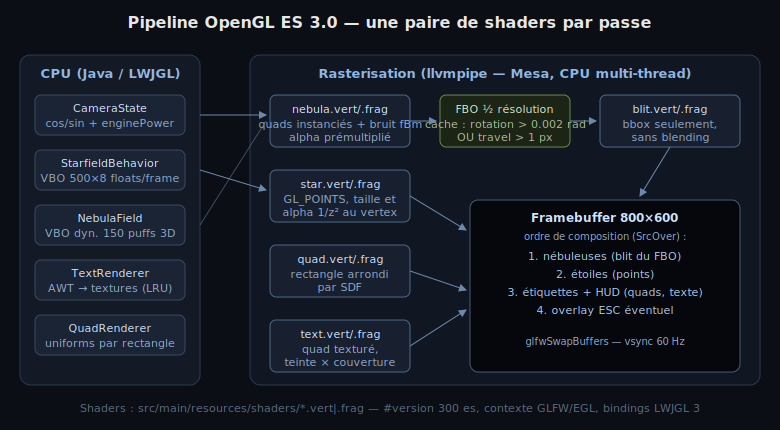
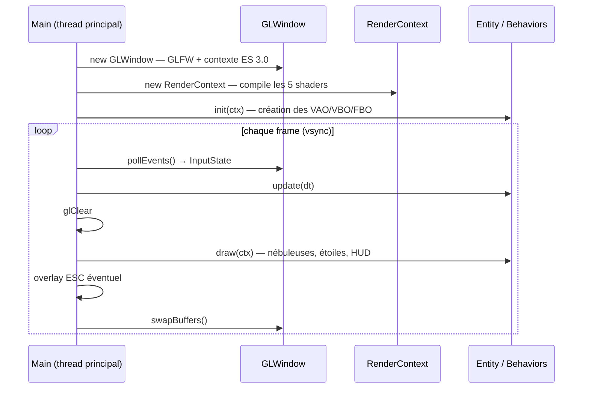
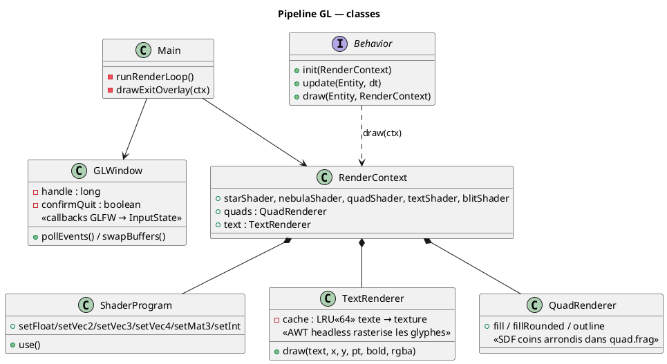

# Chapitre 12 — Pipeline OpenGL ES 3.0 et shaders

## Rôle

Le rendu a été migré de Java2D/Swing vers **OpenGL ES 3.0** via **LWJGL 3**
(bindings GLFW + GLES) : la fenêtre Swing est remplacée par une fenêtre GLFW, la
boucle EDT/Timer par une boucle de jeu classique, et chaque effet visuel par une
**paire de shaders** dédiée dans `src/main/resources/shaders/`. Les formules
physiques (projection perspective, brillance en 1/z², profils radiaux) sont
inchangées — elles s'exécutent désormais dans les vertex et fragment shaders.



> **Honnêteté matérielle** : sur cet Orange Pi, aucun driver GPU n'est actif
> (PowerVR sans pilote). Mesa fournit le contexte ES 3.2 via **llvmpipe**, un
> rasteriseur logiciel multi-thread (~12 ns par pixel blendé sur 8 cœurs). Les
> shaders tournent donc sur CPU ; l'architecture est néanmoins prête à
> s'accélérer telle quelle si un driver EGL/GLES matériel apparaît.

---

## Contexte et fenêtre

`GLWindow` crée la fenêtre et le contexte via GLFW :

```java
glfwWindowHint(GLFW_CLIENT_API, GLFW_OPENGL_ES_API);
glfwWindowHint(GLFW_CONTEXT_VERSION_MAJOR, 3);
glfwWindowHint(GLFW_CONTEXT_VERSION_MINOR, 0);
glfwWindowHint(GLFW_CONTEXT_CREATION_API, GLFW_EGL_CONTEXT_API);
```

avec repli sur `GLFW_NATIVE_CONTEXT_API` si la création EGL échoue.
`GLES.createCapabilities()` initialise les bindings LWJGL, et
`glfwSwapInterval(1)` (vsync) cadence la boucle au taux de l'écran — le Timer
Swing de 16 ms n'a plus de raison d'être (voir [chapitre 7](07-game-loop.md)).



---

## Les cinq paires de shaders

| Fichiers | Passe | Technique |
|---|---|---|
| `star.vert` / `star.frag` | étoiles | `GL_POINTS` : projection, `gl_PointSize`, alpha 1/z² au vertex ; profil radial cœur+halo via `gl_PointCoord` |
| `nebula.vert` / `nebula.frag` | nébuleuses | quads **instanciés** (`glDrawArraysInstanced`), positions 3D finies tournées sur CPU, profil radial × **texture de bruit fBm** (1 fetch/fragment), sortie en alpha prémultiplié |
| `blit.vert` / `blit.frag` | composition nébuleuses | quad texturé sur le rectangle englobant du calque |
| `quad.vert` / `quad.frag` | HUD | rectangle arrondi par **SDF**, remplissage + bordure |
| `text.vert` / `text.frag` | texte | quad texturé, teinte × couverture des glyphes |

Tous en `#version 300 es`, `precision highp float`, chargés et liés par
`ShaderProgram` depuis le classpath (`/shaders/<nom>.vert|.frag`).

### Projection en clip space (star.vert, nebula.vert)

La projection Java2D `px = cx + x/z·s` devient, en espace de clip (y inversé
car OpenGL pointe vers le haut) :

<math xmlns="http://www.w3.org/1998/Math/MathML" display="block">
  <mrow>
    <mtext>clip</mtext>
    <mo>=</mo>
    <mrow>
      <mo>(</mo>
      <mfrac>
        <mrow><mi>x</mi><mo>/</mo><mi>z</mi><mo>·</mo><msub><mi>s</mi><mi>x</mi></msub></mrow>
        <mrow><mi>w</mi><mo>/</mo><mn>2</mn></mrow>
      </mfrac>
      <mo>,</mo>
      <mo>−</mo>
      <mfrac>
        <mrow><mi>y</mi><mo>/</mo><mi>z</mi><mo>·</mo><msub><mi>s</mi><mi>y</mi></msub></mrow>
        <mrow><mi>h</mi><mo>/</mo><mn>2</mn></mrow>
      </mfrac>
      <mo>)</mo>
    </mrow>
  </mrow>
</math>

### SDF du rectangle arrondi (quad.frag)

Le HUD n'utilise plus `fillRoundRect` : la distance signée à un rectangle
arrondi est évaluée par fragment —

<math xmlns="http://www.w3.org/1998/Math/MathML" display="block">
  <mrow>
    <mi>d</mi><mo>(</mo><mi>p</mi><mo>)</mo>
    <mo>=</mo>
    <mo>‖</mo>
    <mo>max</mo><mo>(</mo><mo>|</mo><mi>p</mi><mo>|</mo><mo>−</mo><mi>b</mi><mo>+</mo><mi>r</mi><mo>,</mo><mn>0</mn><mo>)</mo>
    <mo>‖</mo>
    <mo>+</mo>
    <mo>min</mo><mo>(</mo><mo>max</mo><mo>(</mo><msub><mi>q</mi><mi>x</mi></msub><mo>,</mo><msub><mi>q</mi><mi>y</mi></msub><mo>)</mo><mo>,</mo><mn>0</mn><mo>)</mo>
    <mo>−</mo><mi>r</mi>
  </mrow>
</math>

avec $b$ la demi-taille, $r$ le rayon des coins ; $d > 0$ → `discard`,
$-w_{border} < d \le 0$ → couleur de bordure, sinon remplissage.

---

## Flux de données



- **Étoiles** : VBO dynamique interleavé (x, y, z, taille, brillance, r, g, b —
  16 Ko), ré-uploadé chaque frame car les positions évoluent (travel + respawn)
  sur CPU. Dessin : un seul `glDrawArrays(GL_POINTS, 0, 500)`.
- **Nébuleuses** : VBO **dynamique** de 150 instances × 15 floats (~9 Ko) — les
  positions 3D tournent et avancent comme les étoiles ; ré-uploadé uniquement
  quand le cache FBO se re-rend (voir [chapitre 11](11-nebula-field.md)). Une
  texture RGBA 128×128 de bruit fBm (4 champs, 3 octaves, seedée) module le
  profil des puffs.
- **Texte** : AWT (headless) rasterise chaque chaîne une fois en glyphes blancs ;
  la texture est mise en cache (LRU 64 entrées) et teintée par uniform.

---

## Performances mesurées (llvmpipe, 800×600)

| Poste | Coût |
|---|---|
| glClear | ~0,5 ms |
| Nébuleuses (FBO cache hybride + blit bbox) | ~3-5 ms selon le cache |
| Étoiles + étiquettes + HUD | ~5,8 ms |
| **Frame complète** | **66-75 FPS mesurés en dérive brownienne** |

Les optimisations décisives sous rasteriseur logiciel : composition du calque
nébuleuses **hors blending** (écriture directe sur fond noir fraîchement
effacé), blit restreint au **rectangle englobant exact** des puffs visibles
(calculé sur CPU pendant le remplissage du VBO), et **cache hybride du FBO**
entre frames — re-rendu seulement quand la rotation cumulée dépasse 0,002 rad
**ou** que le travel cumulé atteint ~1 px d'écran, avec au moins 2 frames
entre deux passes (voir [chapitre 11](11-nebula-field.md)).

---

> Voir aussi :
> - [06 — Projection perspective](06-perspective-projection.md) — formules portées en GLSL
> - [07 — Boucle de jeu](07-game-loop.md) — boucle GLFW et vsync
> - [08 — Contrôles](08-input-controls.md) — callbacks GLFW
> - [11 — Nébuleuses volumétriques](11-nebula-field.md) — instancing, bruit fBm et FBO
