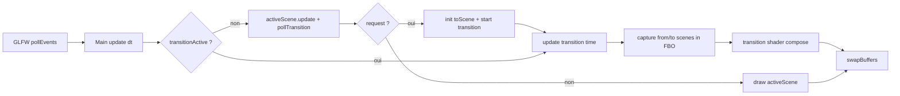
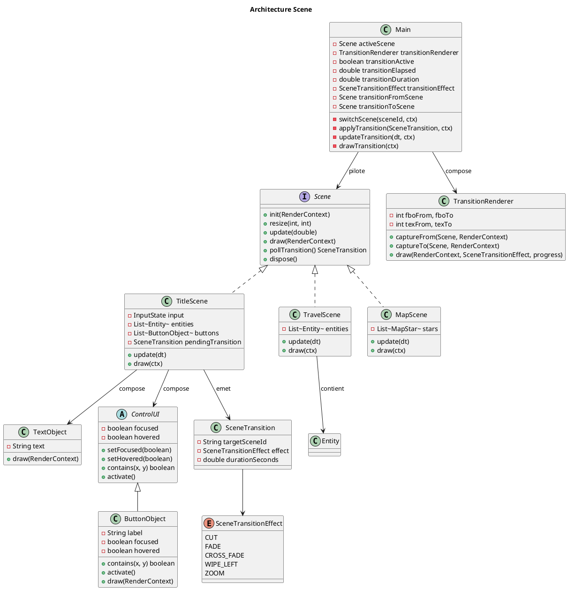

# Chapitre 13 — Scenes et transitions

## Objectif

Le moteur introduit une abstraction `Scene` pour séparer les écrans applicatifs
(titre, menu, simulation, carte, etc.) sans surcharger `Main`. Une scène est
responsable de son cycle de vie (`init`, `resize`, `update`, `draw`), de ses
entités internes et de ses demandes de navigation.

Dans l'état actuel :

- `TitleScene` affiche l'écran titre et propose de démarrer le voyage
- `TravelScene` encapsule l'ancienne simulation (via `ParticleSystem`)
- `MapScene` affiche la carte stellaire interactive
- les transitions sont pilotées par un moteur temporel + compositing offscreen
  (`TransitionRenderer`) entre une scène source et une scène cible


---

## Contrat Scene

```java
public interface Scene {
    default void init(RenderContext ctx) {}
    default void resize(int width, int height) {}
  default boolean onKeyPressed(int key, int mods) { return false; }
  default boolean onKeyReleased(int key, int mods) { return false; }
  default boolean onMouseButtonPressed(int button, double x, double y, int mods) { return false; }
  default boolean onMouseButtonReleased(int button, double x, double y, int mods) { return false; }
  default boolean onMouseMoved(double x, double y) { return false; }
  default boolean onMouseScrolled(double xoffset, double yoffset) { return false; }
    void update(double dt);
    void draw(RenderContext ctx);
    default SceneTransition pollTransition() { return null; }
    default void dispose() {}
}
```

`Main` agit comme un mini scene-manager : il appelle le cycle de vie de la
scène active, route les événements d'entrée bruts (clavier/souris) vers la
scène interactive courante (`onKeyPressed`, `onMouseMoved`, etc.), lit sa
transition éventuelle, puis déclenche le moteur de transition (durée, effet,
scène cible). Pendant la transition, deux scènes coexistent (`from` / `to`) et
sont compositées via shader.



---

## Types de scenes implémentées

### TitleScene

- compose l'écran avec des entités UI : `TextObject` (titre/sous-titre)
  et des contrôles héritant de `ControlUI` (dont `ButtonObject`)
- navigation clavier entre boutons via `TAB` / `SHIFT+TAB`
- navigation clavier également via les flèches (`↑ ↓ ← →`)
- activation d'un bouton par `ENTREE` (focus courant)
- activation souris par clic dans la hitbox du bouton
- bouton `Demarrer` -> `SceneTransition.fadeTo("travel", 0.45)`
- bouton `Quitter` -> `SceneTransition.cutTo("quit")`

### TravelScene

- contient sa liste d'entités de simulation
- instancie `ParticleSystem` (code existant)
- délègue `init/resize/update/draw` à ses entités
- consomme `ESCAPE` et émet une transition de retour vers `TitleScene`



---

## Modèle de transition

Une transition transporte les paramètres nécessaires au moteur :

- scène cible
- type (`CUT`, `FADE`)
- durée

Mathématiquement, un fondu futur peut utiliser :

<math xmlns="http://www.w3.org/1998/Math/MathML" display="block">
  <mrow>
    <mi>α</mi>
    <mo>(</mo><mi>t</mi><mo>)</mo>
    <mo>=</mo>
    <mfrac>
      <mi>t</mi>
      <mi>T</mi>
    </mfrac>
    <mtext>, avec </mtext>
    <mn>0</mn><mo>≤</mo><mi>t</mi><mo>≤</mo><mi>T</mi>
  </mrow>
</math>

et un mix de scènes (cross-fade) :

<math xmlns="http://www.w3.org/1998/Math/MathML" display="block">
  <mrow>
    <mtext>Color</mtext>
    <mo>=</mo>
    <mrow>
      <mo>(</mo><mn>1</mn><mo>-</mo><mi>α</mi><mo>)</mo>
      <mo>·</mo><msub><mi>C</mi><mtext>from</mtext></msub>
      <mo>+</mo>
      <mi>α</mi><mo>·</mo><msub><mi>C</mi><mtext>to</mtext></msub>
    </mrow>
  </mrow>
</math>

Le moteur courant rend **les deux scènes** dans des textures et applique un
shader plein écran selon l'effet choisi.

1. création de `toScene` (init + resize)
2. capture de `fromScene` et `toScene` en FBO chaque frame de transition
3. compositing shader selon l'effet et la progression
4. fin de transition: `activeScene = toScene`, puis `fromScene.dispose()`

avec :

<math xmlns="http://www.w3.org/1998/Math/MathML" display="block">
  <mrow>
    <mi>α</mi><mo>(</mo><mi>t</mi><mo>)</mo>
    <mo>=</mo>
    <mrow>
      <mo>{</mo>
      <mtable>
        <mtr><mtd><mn>2</mn><mi>t</mi></mtd><mtd><mtext>si </mtext><mi>t</mi><mo>&lt;</mo><mn>0.5</mn></mtd></mtr>
        <mtr><mtd><mn>2</mn><mo>(</mo><mn>1</mn><mo>-</mo><mi>t</mi><mo>)</mo></mtd><mtd><mtext>sinon</mtext></mtd></mtr>
      </mtable>
      <mo>}</mo>
    </mrow>
  </mrow>
</math>

Les effets implémentés sont :

- `FADE` : fade-out/fade-in via noir, avec easing non linéaire (in/out plus doux)
- `CROSS_FADE` : mélange progressif source/cible avec courbe temporelle lissée
- `WIPE_LEFT` : révélation gauche->droite de la scène cible avec bord feather adaptatif
- `ZOOM` : zoom-out léger de la source + zoom-in de la cible, avec dissolve eased

Le contrat de scènes reste inchangé ; ajouter d'autres transitions consiste à
étendre la logique de compositing shader.

---

## Points d'extension

- ajouter `MenuScene`, `MapScene`, `SettingsScene` sans toucher aux behaviors
- implémenter un `TransitionController` (fade, wipe, zoom)
- sérialiser un contexte partagé inter-scenes (profil joueur, progression)
- ajouter un routage par identifiants de scène dans la configuration
