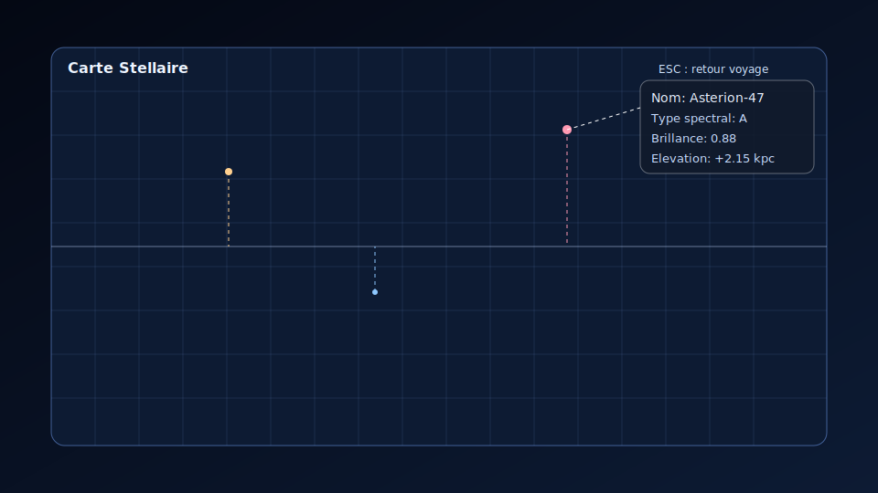
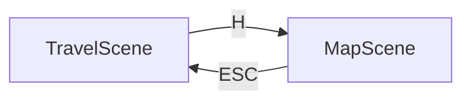
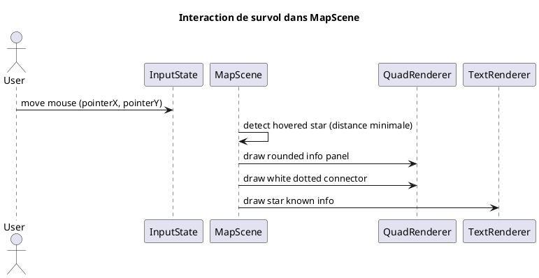

# Chapitre 14 — MapScene et carte stellaire

## Objectif

`MapScene` fournit une vue cartographique **3D** de la galaxie, distincte de la
simulation de voyage. Elle expose une lecture spatiale claire : projection
perspective des étoiles sur une grille à deux niveaux, position relative au
plan galactique, et inspection contextuelle des étoiles au survol.

---

## Navigation inter-scenes

- depuis `TravelScene`, la touche **H** ouvre `MapScene`
- dans `MapScene`, la touche **ESCAPE** retourne vers `TravelScene`
- les transitions de scène utilisent le moteur de transition existant

## Contrôles de caméra carte

- **Flèches** : déplacement latéral/avant-arrière de la carte
- **Q / E** : rotation orbitale (yaw) de la caméra
- **PAGE UP / PAGE DOWN** : zoom clavier
- **Glisser souris (clic gauche maintenu)** : déplacement de la carte
- **Glisser souris (clic droit maintenu)** : rotation orbitale yaw/pitch
- **Molette** : zoom continu

La rotation orbitale est volontairement **sans limite** : yaw et pitch peuvent
enchaîner des tours complets à 360° autour de la carte.

---

## Rendu cartographique 3D

La carte est dessinée dans un panneau principal centré :

- fond sombre semi-transparent avec bord arrondi
- **grille niveau 1** (mineure) espacée régulièrement
- **grille niveau 2** (majeure) plus contrastée (pas 4×)
- ligne du **plan galactique** projetée en perspective

Chaque étoile est représentée par :

- un point coloré (couleur spectrale)
- une liaison en **pointillés** vers sa projection sur le plan galactique

La couleur des pointillés reprend la couleur de l'étoile, renforçant le lien
visuel entre la position 3D et sa projection sur le plan.

---

## Interaction souris

Au survol d'une étoile :

- un panneau flottant apparaît à proximité du curseur
- le panneau est un rectangle à coins arrondis
- son fond est sombre et partiellement transparent
- un lien pointillé blanc relie le panneau à l'étoile ciblée

Informations affichées (si connues) :

- nom procédural
- type spectral
- brillance relative
- élévation par rapport au plan galactique

---

## Projection perspective

Les coordonnées galactiques simulées $(g_x, g_y, g_z)$ sont d'abord exprimées
autour du point de focus $(f_x, f_z)$, puis tournées par la caméra (yaw/pitch),
puis projetées en perspective.

Rotation en yaw/pitch :

<math xmlns="http://www.w3.org/1998/Math/MathML" display="block">
  <mrow>
    <mo>(</mo><msub><mi>x</mi><mn>1</mn></msub><mo>,</mo><msub><mi>z</mi><mn>1</mn></msub><mo>)</mo>
    <mo>=</mo>
    <mrow>
      <mo>(</mo>
      <mi>x</mi><mo>cos</mo><mi>ψ</mi><mo>-</mo><mi>z</mi><mo>sin</mo><mi>ψ</mi>
      <mo>,</mo>
      <mi>x</mi><mo>sin</mo><mi>ψ</mi><mo>+</mo><mi>z</mi><mo>cos</mo><mi>ψ</mi>
      <mo>)</mo>
    </mrow>
  </mrow>
</math>

<math xmlns="http://www.w3.org/1998/Math/MathML" display="block">
  <mrow>
    <mo>(</mo><msub><mi>y</mi><mn>2</mn></msub><mo>,</mo><msub><mi>z</mi><mn>2</mn></msub><mo>)</mo>
    <mo>=</mo>
    <mrow>
      <mo>(</mo>
      <mi>y</mi><mo>cos</mo><mi>θ</mi><mo>-</mo><msub><mi>z</mi><mn>1</mn></msub><mo>sin</mo><mi>θ</mi>
      <mo>,</mo>
      <mi>y</mi><mo>sin</mo><mi>θ</mi><mo>+</mo><msub><mi>z</mi><mn>1</mn></msub><mo>cos</mo><mi>θ</mi>
      <mo>)</mo>
    </mrow>
  </mrow>
</math>

Projection :

<math xmlns="http://www.w3.org/1998/Math/MathML" display="block">
  <mrow>
    <msub><mi>z</mi><mtext>cam</mtext></msub><mo>=</mo><msub><mi>z</mi><mn>2</mn></msub><mo>+</mo><mi>d</mi>
  </mrow>
</math>

<math xmlns="http://www.w3.org/1998/Math/MathML" display="block">
  <mrow>
    <msub><mi>x</mi><mtext>screen</mtext></msub>
    <mo>=</mo>
    <msub><mi>x</mi><mtext>center</mtext></msub>
    <mo>+</mo>
    <mfrac><msub><mi>x</mi><mn>1</mn></msub><msub><mi>z</mi><mtext>cam</mtext></msub></mfrac>
    <mo>·</mo><mi>f</mi>
  </mrow>
</math>

<math xmlns="http://www.w3.org/1998/Math/MathML" display="block">
  <mrow>
    <msub><mi>y</mi><mtext>screen</mtext></msub>
    <mo>=</mo>
    <msub><mi>y</mi><mtext>center</mtext></msub>
    <mo>-</mo>
    <mfrac><msub><mi>y</mi><mn>2</mn></msub><msub><mi>z</mi><mtext>cam</mtext></msub></mfrac>
    <mo>·</mo><mi>f</mi>
  </mrow>
</math>

<math xmlns="http://www.w3.org/1998/Math/MathML" display="block">
  <mrow>
    <mi>u</mi><mo>=</mo>
    <mrow>
      <mn>0.5</mn>
      <mo>+</mo>
      <mn>0.25</mn><mo>(</mo><msub><mi>g</mi><mi>x</mi></msub><mo>+</mo><msub><mi>g</mi><mi>z</mi></msub><mo>)</mo>
    </mrow>
    <mo>,</mo>
    <mi>v</mi><mo>=</mo><mfrac><mrow><msub><mi>g</mi><mi>y</mi></msub><mo>+</mo><mn>1</mn></mrow><mn>2</mn></mfrac>
  </mrow>
</math>

où $d$ est la distance caméra (zoom) et $f$ la focale écran.

---

## Structure logicielle

- `MapScene` gère génération stellaire, projection 3D, survol et rendu UI
- `InputState` expose l'événement transient `mapRequested`
- `InputState` expose aussi `mapZoomIn` / `mapZoomOut`, `mapOrbitLeft` / `mapOrbitRight` et `scrollDeltaY`
- `TravelScene` consomme `mapRequested` pour émettre la transition vers `map`
- `GLWindow` mappe `H`, flèches, `Q/E`, `PAGE UP/DOWN`, clic droit glissé et molette vers les contrôles carte

Cette séparation permet d'ajouter ensuite :

- filtres spectrographiques
- sélection persistante d'étoiles
- mode route/navigation entre systèmes
